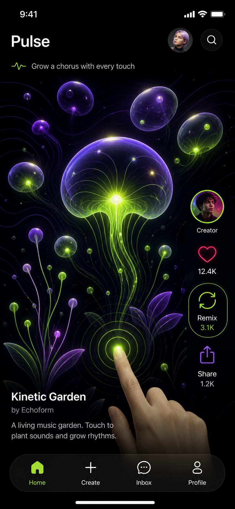

# Pulse iOS

Pulse is a native SwiftUI client for browsing, playing, remixing, creating, and sharing AI-made interactive mini-apps. It is designed around the iPhone 15 Pro canvas (393 × 852 pt) and uses adaptive SwiftUI layouts for later iPhone sizes.



## Product slice

- Full-screen, vertically paged interactive feed with likes and per-work comments/reviews
- Touch-responsive visual canvas, likes, remix, and browser-share entry points
- Prompt-led creator flow and remix lineage
- Private API integration seam in `PulseAPIClient`
- `web-player/`: standalone browser player for published work (no build step)

## Open it

This repository uses [XcodeGen](https://github.com/yonaskolb/XcodeGen) so the Xcode project stays reproducible:

```bash
brew install xcodegen
xcodegen generate
open Pulse.xcodeproj
```

Select an iPhone 15 Pro simulator and run. The deployment target is iOS 17.

For the public player, open `web-player/index.html` with any static web server. It is intentionally dependency-free so it can be deployed to any static host.

## Architecture

`App` owns local feed state, `Domain` defines portable app data and the API boundary, and `Features` contains independent feed, creation, remix, and sharing surfaces. UI is code-native SwiftUI and uses accessibility labels for primary controls.

## API contract

The client expects `POST /v1/apps` from the private `pulse-api` service, returning `{ "url": "https://…" }`. For this MVP the share sheet deliberately displays a deterministic preview URL while backend deployment is being connected.
