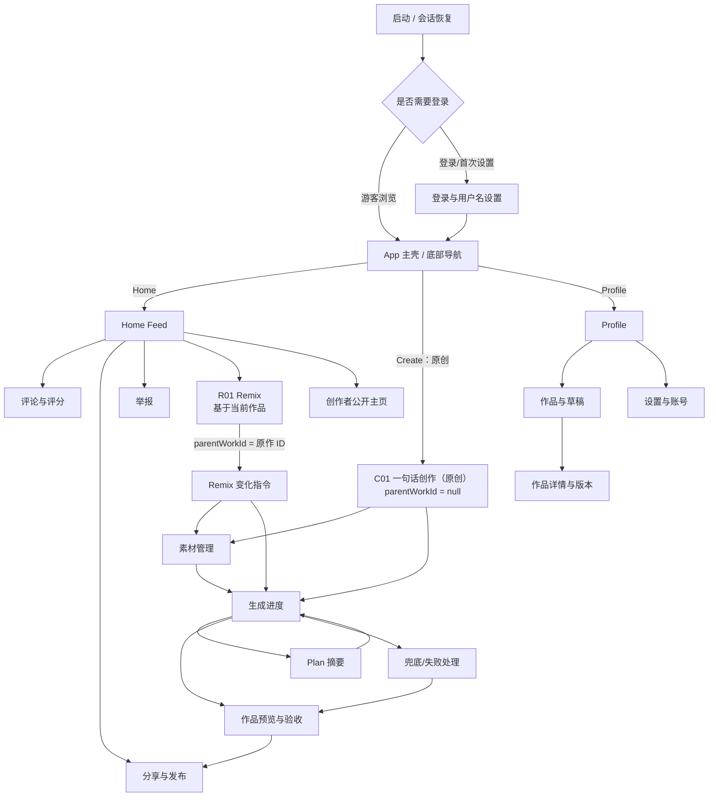
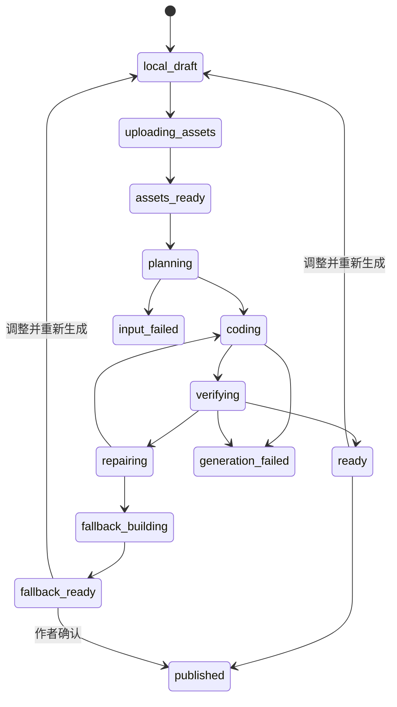

# Pulse 客户端页面设计 PRD

> 文档版本：v1.0
> 文档状态：产品评审稿
> 适用客户端：Pulse iOS（iOS 17+）
> 设计基线：iPhone 15 Pro 画布，适配后续 iPhone 尺寸
> 关联文档：[Pulse 项目方案](../../pulse-api/docs/Pulse项目方案.md)、[Pulse 技术方案](../../pulse-api/docs/Pulse技术方案.md)、[Pulse Coding Agent 技术方案](../../pulse-api/docs/Pulse-Coding-Agent技术方案.md)

## 1. 文档目的

本文将 Pulse iOS 客户端的页面结构、页面目标、信息层级、交互、状态、数据、埋点和验收要求集中到一份可评审 PRD 中，方便产品、设计、客户端、服务端、Agent 平台、测试和内容安全共同确认。

本文不进行人数或日历工期估算。页面进入实现的依据是优先级、前置依赖和验收门禁。

### 1.1 状态标记

| 标记 | 含义 |
| --- | --- |
| `现有原型` | 当前 SwiftUI 代码中已有可运行界面或交互 |
| `P0` | 封闭 Beta 核心闭环必须具备 |
| `P1` | Beta 后增强，不阻塞首次闭环 |
| `P2` | 规模化或商业化阶段再评估 |

### 1.2 本文范围

- App 启动、认证与首次使用。
- Home Feed、作品播放、搜索、评论、分享、举报。
- “一句话 + 图片/视频”创作、Plan、Coding Agent、自动验收、兜底与发布。
- Remix 流程。
- Inbox、Profile、作品/草稿、版本和设置。
- Universal Link 打开作品后的 App 内页面。
- 全局导航、视觉、状态、权限、埋点和无障碍。

不包含后台管理前端和公开 Web Player 的详细页面设计；二者只在与 iOS 跳转、分享或治理相关时说明边界。

## 2. 产品体验目标

### 2.1 核心体验

1. **打开即体验**：用户进入 Home 后无需先理解作品详情，可直接触摸和操作当前作品。
2. **一句话即可独立创作**：用户可从底部 `Create` 直接从零开始原创，不需要先找到或选择现有作品；创作页只要求一句指令，图片和视频是增强输入。
3. **技术过程可理解**：用户看到“素材理解、方案生成、应用构建、自动验收”等产品语言，不暴露命令、容器或模型内部细节。
4. **失败也有结果**：标准产物失败时展示安全兜底预览和差异说明，避免只有模糊错误。
5. **归因始终清楚**：原创作者、直接 Remix 来源和作品版本在消费、创作和分享页面保持一致。
6. **跨端可传播**：发布后的作品可通过公开链接直接试玩，并可回到 App 继续 Remix。

### 2.2 非目标

- 不在 P0 客户端提供源码编辑器、终端、Agent 工具调用明细或完整内部轨迹。
- 不让用户在首次生成前填写复杂技术参数、选择框架或配置依赖。
- 不在 Feed 自动同时运行多个作品。
- 不将 Inbox 私信、多人协作和关注关系作为 P0。
- 不在 iOS 内运行构建工具；客户端只加载已经验收的 Artifact。

## 3. 目标用户与任务

| 用户 | 主要任务 | 页面侧重点 |
| --- | --- | --- |
| 游客体验者 | 浏览、互动、打开分享链接 | 低阻力、快速加载、明确登录触发点 |
| 登录体验者 | 点赞、评论、举报、分享 | 乐观反馈、状态一致、治理入口易找 |
| 轻创作者 | 一句话 + 素材生成作品 | 输入简单、过程透明、失败可恢复 |
| Remix 创作者 | 在原作基础上修改意图和素材 | 归因清楚、继承边界可理解 |
| 作品作者 | 管理草稿、版本、发布与撤销 | 状态准确、风险动作明确、结果可追溯 |

## 4. 信息架构

### 4.1 主导航

首发底部使用三个固定业务入口：

- **Home**：发现和体验作品。
- **Create**：独立原创入口；不依赖现有作品，也不携带 Remix 血缘。
- **Profile**：个人资料、作品、草稿、链接与设置。

`Create` 是类似 TikTok 的常驻主创作入口：使用独立的加号按钮、荧光描边/填充和高于普通 Tab 的视觉层级，位于底部导航的主视觉位置。从任意 Tab 点击后直接进入 C01“一句话创作”，默认创建原创草稿。它不是 Remix 的快捷方式，也不能继承用户刚浏览作品的 `parentWorkId`。

底部导航需要使用自定义 Tab Bar，而不是简单平均分配系统 Tab：普通入口保持稳定位置，Create 保持显著、可单手触达，并始终显示“一句话创作”的无障碍名称。已有未提交原创草稿时可提示继续或新建，但不得自动切换成 Remix 草稿。

Inbox 仍是 P1 规划中的通知中心，但首发未完成前不展示入口或占位页；生成恢复入口由 Profile 的作品/草稿页承接。

### 4.2 页面关系

### 4.3 导航规则

- Home、Create、Profile 根页面各自维护 NavigationStack；切换 Tab 保留已有栈。重复点击当前 Tab 返回该 Tab 根页面或顶部：Home 回到 Feed 顶部，Profile 清空当前路径回到 Profile 根；Create 没有更深的主导航路径，不会因重选丢弃未提交草稿。隐藏的 Home 必须暂停 Artifact Runtime。
- 点击底部 Create 始终进入原创 C01；任何浏览中的作品上下文都不能被隐式带入。
- 模态 Sheet 用于评论、分享、举报和轻量 Remix 输入；完整创作、生成进度、预览使用全屏导航。
- Universal Link 打开作品时进入 App 内作品播放页；关闭后回到原导航栈，没有原栈时回到 Home。
- 登录拦截不得丢失用户意图：点赞、评论、举报、Remix、创作或发布在登录成功后恢复到原操作。新账户必须先完成 A02；随后恢复 Feed 点赞、作品/评论屏蔽的原确认对象、同一作品的评论/举报草稿和 Remix 编辑器。评论与举报在登录后只能回填原对象与当前内存草稿，仍须由用户再次确认发送，绝不自动提交；用户取消登录则只关闭登录层，不执行原动作。
- 已删除、隐藏或链接撤销的作品不能静默跳到其他内容，必须展示明确失效页。

### 4.4 原创与 Remix 的产品边界

| 维度 | 一句话原创 | Remix |
| --- | --- | --- |
| 入口 | 底部导航 Create | 现有作品 Action Rail/播放页的 Remix |
| 是否需要现有作品 | 不需要 | 必须有一条可 Remix 的已发布作品 |
| 页面 | C01 | R01，之后复用 C02–C06 |
| `creationMode` | `original` | `remix` |
| `parentWorkId` | 必须为空 | 必须等于入口原作 ID |
| `rootWorkId` | 服务端设为新作品自身 | 服务端从原作血缘派生 |
| 默认素材 | 空；用户自行上传 | 只引用原作允许继承的公开素材，用户可补充自己的素材 |
| 归因展示 | “Original”或无 Remix 标签 | 始终展示“Remix of …”和原创作者 |

两条路径共享素材处理、Plan、Coding Agent、自动验收、预览和发布能力，但入口、血缘、默认上下文和埋点必须分开。

## 5. 页面清单

| ID | 页面 | 优先级 | 当前状态 | 主要入口 |
| --- | --- | --- | --- | --- |
| G01 | 启动与会话恢复 | P0 | 需新增 | App 启动、深链 |
| A01 | Apple 登录 | P0 | 需新增 | 受限操作、Profile、首次创作 |
| A02 | 首次资料设置 | P0 | 需新增 | 首次登录成功 |
| H01 | Home 全屏 Feed | P0 | 现有原型 | Home Tab、App 默认入口 |
| H02 | App 内作品播放页 | P0 | 部分复用 Feed | Universal Link、通知、作品列表 |
| H03 | 搜索 | P1 | 不进入首发，入口已移除 | 后续由产品单独开放 |
| H04 | 评论与评分 | P0 | 现有原型 | Feed/播放页评论按钮 |
| H05 | 分享与发布 | P0 | 现有原型，需真实接入 | Feed/预览页分享按钮 |
| H06 | 举报 | P0 | 需新增 | 作品更多菜单、评论更多菜单 |
| H07 | 创作者公开主页 | P1 | 需新增 | 作者头像/名称 |
| C01 | 一句话创作（原创） | P0 | 现有 Prompt 原型 | 底部导航 Create；不从 Remix 进入 |
| C02 | 素材选择与管理 | P0 | 需新增 | C01 添加素材 |
| C03 | 生成进度 | P0 | 需新增 | 提交生成、继续查看任务 |
| C04 | Plan 摘要 | P0 | 需新增 | C03 查看方案 |
| C05 | 作品预览与验收 | P0 | 需新增 | 生成正常/兜底完成 |
| C06 | 生成失败与兜底处理 | P0 | 需新增 | Agent/验证终态 |
| R01 | Remix 输入 | P0 | 现有原型，需升级 | 现有作品的 Feed/播放页 Remix |
| I01 | Inbox 列表 | P1 | 首发不展示入口 | 后续通知中心 |
| I02 | 通知关联内容 | P1 | 需新增 | Inbox 条目 |
| P01 | 我的 Profile | P0 | 已有基础资料、设置、数据导出、任务恢复、账号删除确认、公开链接撤销、生命周期筛选、作者详情与只读版本入口；当前候选的真实静态海报和历史候选的私有只读预览已接入，Remix 可打开服务端确认仍公开的根原作并按需查看完整公开血缘，生产/真机演练仍待完成 | Profile Tab |
| P02 | 我的作品与草稿 | P0 | 已有生命周期筛选、当前版本摘要、更新时间、状态匹配的恢复/撤销/详情/版本动作，以及按需、受鉴权的真实静态海报；已完成历史候选可由作者在版本页私有只读预览，不能切换或发布；Remix 原作与完整血缘入口仅在服务端逐环可见时开放，生产/真机回归仍待完成 | Profile 分段列表 |
| P03 | 作品详情与版本 | P0 | 已有作者专属详情、当前候选受限预览、生命周期/审核/验证状态、原创/Remix 归因、统计、当前公开版本标识及直接分享入口和只读候选时间线；作者可为草稿或已发布作品切换后续 Remix 许可。审核拒绝时明确说明当前版本仍私有、可创建新版本；配置安全支持链接时提供不携带作品信息的支持入口，不显示审核员身份或内部规则。完成的历史候选可私有只读预览，但不提供分享、切换或重新发布；Remix 可跳转仍公开的根原作并按需查看完整公开血缘；其余管理动作仍待完成 | P02 作品条目 |
| P04 | 设置与账号 | P0 | 已有账号资料/退出、屏蔽名单、数据导出、Apple 再授权删除、匿名诊断、条件化帮助与隐私协议入口、版本/构建号，以及“允许 Remix 新作品”的本地默认值；播放/流量偏好仍待产品与服务端能力闭环 | Profile 设置按钮 |
| X01 | 全局失效/不可用页 | P0 | 需新增 | 深链、已撤销内容、版本不兼容 |

## 6. 全局视觉与交互规范

### 6.1 视觉方向

- 主背景为接近纯黑，内容层使用半透明黑、材质模糊和低对比描边。
- 主强调色使用 Pulse Lime；Remix/AI 状态可使用 Violet；风险、失败和点赞使用 Coral/Red，但不能只靠颜色表达状态。
- Feed 作品本身是主视觉，UI 采用覆盖层，避免大面积卡片遮挡互动区域。
- 标题使用圆角、紧凑、较强字重；正文保持高可读性，避免荧光色承载长段正文。
- 图标优先使用 SF Symbols；关键操作同时有文本或无障碍标签。
- 动效用于表达触摸响应、生成阶段切换和成功状态，不用于遮掩等待或制造虚假进度。

### 6.2 设计 Token 建议

| Token | 建议值/语义 |
| --- | --- |
| `surface.base` | `#050505` |
| `accent.primary` | Pulse Lime，约 `#B4FF14` |
| `accent.ai` | Pulse Violet，约 `#9452FF` |
| `accent.danger` | Pulse Coral，约 `#FF596F` |
| `text.primary` | 白色高强调 |
| `text.secondary` | 白色中等透明度 |
| `border.subtle` | 白色低透明度 |
| `radius.card` | 中到大圆角，按容器层级统一 |
| `radius.action` | 胶囊或圆形 |

最终颜色和尺寸以设计系统文件为准；本文定义语义而非替代视觉稿。

### 6.3 安全区域与响应式

- Feed 和播放内容可延伸到全屏，但顶部标题、操作栏和底部 Tab 必须避让 Safe Area。
- 主交互目标不能被 Home Indicator、Dynamic Island、键盘或底部 Tab 遮挡。
- 小尺寸设备优先保证作品互动区、主 CTA 和错误信息；非关键说明可折叠。
- 横屏作品由 Artifact 声明支持能力；不支持时锁定竖屏或显示旋转提示。
- 大字体模式下允许内容滚动，不通过缩小字体强行塞入。

### 6.4 无障碍

- 每个按钮提供用途明确的 Accessibility Label，计数与动作合并朗读。
- 动态 Canvas/Web 作品提供作品名称、互动说明和静态预览兜底。
- 支持 Reduce Motion；作品无法降级时暂停非必要动画并说明。
- 支持 VoiceOver 顺序：页面标题 → 作品说明 → 主操作 → 次操作 → 导航。
- 评分控件可直接选择具体分值，不能只依赖横向手势。
- 颜色状态同时使用图标、文本或形状表达。

### 6.5 当前无障碍实现边界

- Feed、预览和生成进度会读取系统 Reduce Motion：原生 Canvas 与阶段动画静止；Web Artifact 通过受限运行时收到 `pulse:motion-preference` 与 `pulse:pause` 事件，同时注入最小 CSS 降低非必要 CSS 动画。生成模板仍必须自行响应该事件并为 Canvas/游戏循环提供静态或低动态模式，不能把宿主注入当作 Artifact 无障碍验收的替代。
- 原生 Canvas 把作品标题、主题、动态状态和可操作说明作为一个 VoiceOver 元素，并提供调节手势在不拖动屏幕的情况下移动视觉焦点；Web Artifact 由原生宿主提供标题/主题摘要，实际游戏和表单控件仍需由独立 Verifier 检查语义 HTML、焦点顺序和键盘/VoiceOver 操作。
- Feed 操作栏以动作加完整计数朗读，评论评分明确读出当前选择；底部 Tab 会以选中状态和语义字体响应 Dynamic Type。仍需在真机使用 Accessibility Inspector、VoiceOver、Voice Control、最大 Dynamic Type、Increase Contrast 和实际 Artifact 样本执行回归，才能关闭 IOS-017。

## 7. 全局页面状态

### 7.1 通用状态

每个读取型页面必须定义：

- **首次加载**：骨架或品牌加载态，不显示错误计数和空数据闪烁。
- **刷新**：保留现有内容，局部展示刷新状态。
- **空状态**：说明为什么为空，并给出唯一主行动。
- **可恢复错误**：简洁错误、重试按钮和保留已有内容。
- **不可恢复错误**：明确下一步，如返回、联系支持或重新生成。
- **离线**：显示缓存内容和离线标识；禁止误报发布/评论成功。
- **权限受限**：说明需要登录、媒体库权限或作者身份。
- **内容失效**：下架、删除、撤销、版本不兼容分别映射到用户可理解文案。

### 7.2 写操作反馈

- 点赞等低风险操作可乐观更新，失败后回滚并轻提示。
- 评论、发布、撤销、删除等操作以服务端确认作为成功依据。
- 所有提交按钮在请求中防重复触发；幂等键由客户端请求层管理。
- 破坏性操作使用确认页或确认弹窗，展示对象名称和影响范围。
- 不能用无限旋转指示器代替状态；长任务进入 C03 可离开页面并继续后台处理。

## 8. 页面详细设计

### G01 启动与会话恢复

**目标：** 恢复用户会话、远程配置和深链目标，在无法恢复时安全进入游客模式或登录。

**页面结构：**

- 黑色背景与 Pulse 标识。
- 不展示虚构百分比。
- 若遇到必须处理的问题，切换为品牌化错误状态，而不是停留在启动图。

**核心逻辑：**

1. 先获取 `GET /v1/client-configuration` 的维护状态、最低 iOS 版本/build 和支持/升级地址；维护或强制升级时不创建内容壳。若网络不可达，只能使用同一 API Origin、保存不超过 5 分钟的启动配置，并且必须同时存在未过期的公开 Feed 快照；缓存配置中的维护和强制升级仍照常阻断。
2. 仅在配置允许时读取本地会话并刷新身份，然后加载 Feed。
3. 有 `pulse://remix/{workId}` 或已配置 Universal Link 域名下的 `/remix/{workId}`、`/a/{publicSlug}` 时先暂存；前者向服务端确认已发布且允许 Remix，后者确认公开 slug 仍有效后以单独的全屏共享作品播放器打开。失败保留目标并提供重试，不把失效链接回退到任意 Feed 或创作页。
4. 会话有效则进入目标页面或 Home；会话失效但目标公开则以游客打开；受限目标进入 A01。使用启动配置缓存时只能进入只读 Home，不恢复会话、深链、创作、互动或账号工具。

**当前实现：** 黑色启动门禁提供 loading、维护、强制升级和网络不可用状态；维护页可检查服务是否恢复，支持/升级链接只接受服务端配置的 URL。Release 只接受构建期注入的 HTTPS API Origin 与 Universal Link Host，默认 `configure-*.invalid` 会安全停在启动门禁，不能用 localhost、`.example` 或进程环境覆盖绕过。公开 Player 的 `build:release` 还要求与 entitlement 同一 Host 的 Apple Team ID 和 Bundle ID，自动生成仅匹配 `/a/*`、`/remix/*` 的 `apple-app-site-association`；部署、Apple CDN 获取与真机验证尚未完成。启动配置会绑定 API Origin 缓存最多 5 分钟；只有该缓存和 15 分钟内的公开 Feed 快照同时有效时才进入带显式“Offline”标识的只读 Home，作品运行时、登录、深链、创作、互动和账号工具均不会开放。缓存中的维护/强制升级仍会阻断。受审计的远程配置动态分发、灰度与回滚和真机弱网证据仍未完成。

**状态：** 正常、离线缓存、会话刷新失败、强制升级、服务维护、深链无效。

**验收：**

- 会话失败不会造成启动死循环。
- 深链目标在登录前后保持一致。
- 强制升级与维护状态具有明确行动。

### A01 Apple 登录

**目标：** 在不打断游客浏览的前提下，为点赞、评论、创作、Remix、发布和 Profile 提供身份。

**入口：** Profile Tab；游客执行受限操作；首次创作；被撤销的 Refresh Token。

**页面结构：**

- Pulse Logo 与一句价值说明。
- “通过 Apple 继续”主按钮。
- 用户协议、隐私政策和 AI 生成内容说明链接。
- “暂时浏览”次行动，仅在入口允许游客返回时显示。

**交互：**

- 登录成功：若启动配置提供的当前 Terms of Use URL/版本尚无服务端回执，先进入不可跳过的条款确认页；用户可外开阅读并点击明确确认，客户端不提交 URL/版本，由服务端写入当前回执。确认前不恢复创作、互动或资料编辑，版本更新时必须再次确认；游客浏览、举报、屏蔽、退出、导出和删除仍可用。已确认的已有用户恢复原操作；新用户随后进入 A02。
- 用户取消：回到原页面，不显示错误告警。
- 验证失败：显示可重试错误，不暴露 Token 或供应商细节。

**埋点：** `auth_viewed`、`auth_started`、`auth_cancelled`、`auth_succeeded`、`auth_failed`，携带 `entryPoint`，不携带身份令牌。

### A02 首次资料设置

**目标：** 在已明确确认当前 Terms of Use 后，建立可公开展示的用户名和展示名。

**页面结构：**

- 头像选择，可跳过。
- 用户名：唯一、规范化、实时提示可用性。
- 展示名：可与用户名不同。
- 完成主按钮。

**规则：**

- 用户名格式、长度、保留词和审核规则由服务端权威返回。
- 用户名冲突提供可解释建议，不自动替用户提交其他名称。
- 用户修改用户名后，现有作品（含原作署名）、草稿/生成恢复、评论、私有素材、点赞、屏蔽和举报历史仍属于同一账户；客户端以服务端返回的当前资料刷新展示，不把旧用户名当作本地所有权或幂等键作用域。
- 首次用户名/展示名和之后的资料修改都属于公开 UGC：Apple 身份必须先由 Pulse 验证，服务端再仅对将持久化的用户名/展示名执行当前社区政策检查。`content_policy_rejected` 时保留当前本地输入并以中性文案提示修改；`content_safety_unavailable` 时保留输入并允许稍后重试，不能创建部分账户、展示内部规则或将服务故障归因为用户违规。
- 完成前退出时保留安全草稿；再次进入继续设置。

**验收：** 不能通过客户端绕过敏感词、唯一性或保留用户名限制。

### H01 Home 全屏 Feed

**状态：** `部分实现`，已接入服务端游标分页、有限期公开缓存、原生下拉刷新与当前作品单活跃运行时；下拉刷新期间保留当前内容，只在成功响应后替换，失败继续显示原 Feed 与可恢复错误，离线只读 Home 不发刷新请求。当前阅读位置距末尾两项时会预取下一页**元数据**，不提前启动 Artifact。当前作品之后最多两张相邻卡片可按需读取服务端返回的固定 `preview.png`，在离屏时只显示该静态海报、不创建或执行 Web Bundle。预览只保存在内存（单图最多 1 MiB、总计最多 3 MiB/6 张），不写入离线 Feed 快照；没有经过服务端绑定海报时维持不运行的静态 Canvas。宿主也会响应 `AVAudioSession` 中断和内存告警。Artifact 加载中或失败会保留静态作品摘要；客户端会把稳定错误码和 HTTP 状态安全映射为下架、受限、版本不兼容、离线、临时不可用或通用不可用，并提供重试且不阻止继续浏览。仍需要受限资源预取、服务端年龄/兼容过滤联调及真机弱网矩阵。

**目标：** 让用户无需进入详情即可连续发现和体验互动作品。

**页面布局：**

- 顶部：Pulse 品牌；可选当前用户头像。搜索不属于首发，未接入真实搜索结果前不得展示图标或可点击入口。
- 中央：当前作品互动运行区，占据主要屏幕。
- 左下：Prompt/一句话意图、作品标题、作者、主题描述、Remix 归因；已审核作品显示“Reviewed for 4+”文字与盾牌图标，不能只用颜色表达。
- 右侧 Action Rail：作者、点赞、评论、Remix、分享；计数使用紧凑格式。
- 底部：半透明胶囊三 Tab，Create 保持主视觉层级。
- 背景：作品实时渲染；上下使用渐变保证文字对比度。

**核心交互：**

- 纵向分页切换作品，一次只激活当前作品。
- 在互动区点击、拖动、长按等行为交给作品；页面滑动与作品手势冲突由运行时协议处理。
- 点赞乐观更新；评论打开 H04；Remix 打开 R01；分享打开 H05。
- 点击作者进入 H07；点击作品标题进入 H02 或展示详情层。
- 作品音频必须由用户动作启用，离屏后暂停。
- 应用进入 `inactive` 或后台、当前作品离屏、以及评论/分享/举报/Remix 等遮挡层出现时，Canvas 必须切为静态帧，Web Artifact 必须收到 `pulse:pause` 并取消未完成的 Bundle 请求；恢复前台可派发 `pulse:resume`，但不得替用户自动重新播放音频。
- 宿主收到 `AVAudioSession` 中断或内存告警时，必须对全部互动运行时施加同一暂停闸门；内存告警不能在原地静默重建 Web Runtime，至少完成一次真实的非活跃/前台生命周期往返后才可重新允许运行，且仍不得自动播放音频。

**Feed 预取：**

- 当前阅读位置距末尾两项时预取下一页元数据并追加到 Feed；它不得创建 `WKWebView`、下载/执行 Artifact 或写入用户状态。
- 当前作品之后最多两张相邻作品可预取静态海报，但仅接受 Feed 为其**当前、已审核公开 Artifact**返回的同源、无查询参数、固定路径 `preview.png`。海报单图上限 1 MiB，进程内总缓存上限 3 MiB/6 张，并发同一 Artifact 只读取一次；它不落盘、不进入公开 Feed 快照，也不能作为 Artifact Bundle、可执行资源或历史候选的读取入口。刷新、撤销或下架后，卡片不再从 Feed 出现，服务器的 Artifact 授权门禁仍是最终失效边界。
- 受限 Bundle/素材资源预取仍待资源预算、CDN 失效和真机弱网策略后实施。
- 不同时启动多个 Web Bundle/Canvas。
- 成功请求后最多保存 50 个公开作品与下一页 cursor，缓存只保留 15 分钟；保存前清除 `viewerHasLiked` 等账号状态并绑定 API Origin，损坏、未来时间、跨环境、超期或空 Feed 快照一律不用。若为上限截断的快照，必须丢弃无法与截断内容对应的后续 cursor，不能跳过中间作品。
- 网络刷新失败但有有效快照时，顶部明确说明正在浏览保存副本并提供重试；无缓存时显示可恢复错误，不能使用演示作品或历史内容伪装为线上结果。
- 冷启动离线回退还需要一份同源、至多 5 分钟的启动配置；命中后 Feed 只能只读浏览，互动运行时不加载，点赞、评论、举报、屏蔽、Remix、创作和账号工具必须说明“需要连接”而非制造失败写操作。
- 当前 Artifact 失败时显示静态预览和“Try again”，明确仍可继续滑到下一条。不得展示服务端原始错误、内部 ID、私有作品存在性或审核理由；稳定错误码或状态只可映射为下架、受限、版本不兼容、离线、临时不可用或通用不可用。链接已失效则走 X01，不能假装内容仍可打开。
- 已发布作品存在 `artifactId`/`artifactEntryUrl` 时，由客户端 Artifact Player 直接加载服务端不可变 Bundle；底部保留交互安全区，生成作品的触控目标不得落入 Pulse Tab Bar 命中区域。
- Home 只消费服务端已批准的公开目录：首发必须同时是 `verified`、审核 `approved`、年龄 `4+` 且有 Artifact 入口；客户端不得以隐藏 Badge 代替服务端访问限制。

**状态：**

- 首屏骨架、正常、分页加载、Feed 空、离线缓存、作品资源失败、Artifact 下架/受限/不兼容/离线/临时不可用。
- Feed 空状态主行动为“去创作”；游客可先展示官方种子作品。

**关键埋点：**

- `feed_impression`：作品达到可视标准。
- `play_started`：首次有效作品交互。
- `meaningful_play`：达到产品配置的有效体验条件。
- `feed_swiped`、`like_toggled`、`comments_opened`、`remix_opened`、`share_opened`。

**验收：**

- Action Rail 不遮挡作品主要交互目标。
- 切换作品后上一作品动画、音频和定时器停止。
- 锁屏、电话中断、Control Center、后台、内存警告和音频中断必须在真机验证运行时、请求、CPU 与音频均已停下；本地状态组合测试不能替代该门禁。
- 网络失败不会清空已有 Feed。
- 下拉刷新只在成功响应后替换 Feed；失败保留现有内容，离线只读 Home 不发刷新请求。
- Artifact 网络失败保留静态摘要、原因与重试，并不阻断评论等浏览操作；已由 API 集成测试覆盖真实对象缺失的 `404 artifact_file_missing` 与存储故障的 `503 artifact_storage_unavailable`，后者不得提示“作品已被移除”。受限/不兼容的 `403/422` 仍需在对应服务端策略落地后补集成回归。
- 服务端计数返回后修正客户端乐观值。
- 年龄审核标识会随作品标题一起被 VoiceOver 朗读；没有批准标识的作品不应进入公开 Feed。

### H02 App 内作品播放页

**目标：** 从深链、通知、Profile 或作品列表打开单个作品，并提供比 Feed 更稳定的上下文。

**布局：**

- 顶部返回、作品状态/来源、更多菜单。
- 中央全屏或适配比例的 Artifact Host。
- 可折叠信息层：标题、作者、Prompt、说明、版本、Remix 来源。
- 底部操作：点赞、评论、Remix、分享。

**与 Feed 差异：**

- 不支持纵向切换其他作品。
- 信息层可展开查看血缘和版本。
- 游客从公开链接发起 Remix 时先显示 A01；认证成功并完成 A02 后恢复同一作品的 Remix 编辑器，取消登录不创建草稿或 Generation。
- 深链失效进入 X01，不回退到随机 Feed。

**状态：** 公开作品、作者预览草稿、fallback 预览、下架、撤销、版本不兼容、离线缓存。

### H03 搜索

**优先级：** P1。

**目标：** 搜索作品、作者和主题，而不干扰 Home 的沉浸体验。

**页面结构：**

- 搜索框与取消。
- 输入前：最近搜索、推荐主题，可配置关闭。
- 输入后分段：作品、创作者、主题。
- 作品结果使用静态预览卡片，不自动运行互动内容。

**状态：** 未输入、联想、结果、无结果、错误、离线最近结果。

**规则：** 搜索历史默认仅保存在本地；敏感查询不写普通分析事件。

### H04 评论与评分

**状态：** `部分实现`，已接入真实 API、服务端游标分页、作者删除、举报/屏蔽、同草稿幂等提交、登录后草稿恢复和隐藏状态呈现；真机回归仍待完成。

**呈现：** 从 Feed/播放页以 Bottom Sheet 打开，可向上扩展为全屏。

**结构：**

- 标题与可见评论数。
- 评论列表：头像、用户名、1–5 分、正文、发布时间语义、更多菜单。
- 空状态：“成为第一个评论的人”。
- 底部输入：评分选择、评论正文、发送。

**交互规则：**

- 游客可先在当前 Comment Sheet 本地编辑评分和正文；点击发送时进入 A01。认证成功且完成首次资料设置后，回填同一作品、正文、评分和 `Idempotency-Key`，由用户再次点击发送，绝不自动发布。访客草稿不上传、不写入 Keychain，关闭评论 Sheet 即丢弃；登录用户在退出或切换账号时也会清空当前输入，不能由另一账号恢复。
- 正文去除首尾空白；服务端控制长度和内容审核。`content_policy_rejected` 时保留本地草稿、以中性社区规范文案提示修改后重试，不泄露检测细节；`content_safety_unavailable` 时保留同一草稿和幂等键，提示稍后重试，不能把检查服务故障伪装为用户违规或发送成功。
- 发送成功后插入顶部并使用服务端评论实体。
- 提交时客户端为当前正文和评分生成并保留 `Idempotency-Key`；同一草稿的未知响应重试必须复用该键，服务端返回最初创建的评论而非再写一条，且该重放不应消耗新的评论限额。用户修改正文或评分后才生成新键。
- 首屏加载 30 条；服务端返回 `nextCursor` 时显示“Load more comments”。追加失败保留已加载讨论并允许再次尝试，追加结果按评论 ID 去重，不因新评论写入而重复现有条目。
- 作者可删除自己的评论；其他用户可举报；运营隐藏后计数以服务端为准。被隐藏的评论不再返回给公众或其他已登录用户；作者仍会看到仅自己可见的原评论及“Not visible to others”中性说明和 Community guidelines 入口，客户端不得展示审核员理由。
- 作品与评论的安全菜单都必须提供 Community guidelines，并以可关闭 Sheet 呈现，不打断当前 Feed 或评论上下文。

**状态：** 加载、分页、空、提交中、审核中、提交失败、评论被隐藏、评论已删除。

**验收：**

- 重复提交不产生重复评论。
- 评分可被 VoiceOver 精确选择。
- 关闭 Sheet 后 Feed 计数同步更新。

### H05 分享与发布

**状态：** `现有原型`，需移除固定预览 URL。

**场景 A：分享已发布作品**

- 仅当服务端已返回 `publicURL` 时展示公开 URL 域名、分享预览卡和系统 ShareLink；分享 Sheet 不承担发布动作，也不得用本地拼接 URL 冒充公开链接。
- 操作：复制链接、系统分享、打开 Web 预览、举报异常链接。
- 没有 `publicURL` 时明确说明该版本尚未公开；消费侧用户不能在分享 Sheet 触发作者的发布操作。
- 公开 Web Player 的 `Report in Pulse` 只传递 `pulse://report/{publicSlug}`。App 必须重新请求公开作品并确认 slug 仍对应已发布版本，随后才打开现有举报表单；失效、撤销或网络异常进入 X01 安全终态，不能把 slug、标题或审核原因当作可信的深链参数。

**场景 B：作者发布草稿/新版本**

- 展示作品标题、验证等级、公开后可见信息、Remix 权限。
- `verified`：允许直接发布。
- `degraded`：展示降级项，由产品策略决定是否允许作者确认发布。
- `fallback`：明确“安全简化版”，必须作者确认后才能公开。
- 硬门禁失败：不展示发布按钮，跳转 C06。

**场景 C：撤销公开**

- 仅作者/管理员可见。
- 确认内容说明公开链接将立即失效，作品草稿和审核记录仍保留；成功后不再显示旧 URL，Feed 和公开目录同步移除。
- 再次公开必须重新确认发布，并使用服务端返回的新 URL；客户端不能继续复用已撤销 slug。

**验收：**

- 发布成功使用服务端真实 URL。
- 重复点击不创建多个公开版本。
- 撤销后客户端不继续显示“已公开”。

### H06 举报

**目标：** 为作品和评论提供低摩擦但可审计的治理入口。

**页面结构：**

- 被举报对象摘要。
- 单选原因：不当内容、版权、冒充、垃圾信息、安全问题、其他。
- 可选补充说明。
- 提交按钮与匿名性说明。

**规则：**

- 仅登录用户提交。游客可以在当前举报 Sheet 选择原因和填写不超过 1,000 字符的补充说明；点击提交才进入 A01，草稿不上传、不写 Keychain，关闭举报 Sheet 或取消登录即丢弃。认证成功且完成 A02 后回填同一待举报对象、原因和说明，并由用户再次点击提交，绝不自动上报；已登录用户退出或切换账号时同样清空当前草稿。
- 同一用户重复举报返回已有处理状态，不制造重复记录。
- 举报成功只确认已收到，不承诺处理结果。
- P04 设置页提供“Your reports”历史：仅显示本人案件的已收到、审核中或已完成状态和时间；不得显示审核员身份、内部备注、被处理账号或具体处置结果，并支持手动刷新和翻页。
- 报告和屏蔽入口的同一安全菜单提供 Community guidelines，帮助用户在提交前理解社区边界。

### H07 创作者公开主页

**优先级：** P1。

**结构：** 头像、用户名、展示名、简介、公开作品、Remix、作品统计；关注能力不属于 P0。

**规则：** 只显示已发布且未隐藏作品；删除账号按隐私策略去标识化。

### C01 一句话创作（原创）

**状态：** 已具备原创 Prompt、资源选择和服务端生成主链路；访客可以仅在当前 Create 页面本地编辑 Prompt，点击生成或添加资源时才登录，成功后恢复原创/Remix 上下文与 Prompt，仍须再次确认生成。访客 Prompt 不上传、不写 Keychain，离开页面或切换账号即丢弃。本地仅将已登录账号隔离的指令、服务器素材 ID 与稳定幂等键写入 Keychain，绝不保存私有素材字节、对象路径、Session 或生成源码。私有素材在当前会话中会显示准备、真实字节上传、服务端校验、取消和重试；若服务端明确返回 `content_safety_unavailable`，已上传对象保留为 `uploading`，界面改为“Check again”，仅重试完成校验而不重新上传字节。为应对 App 重启，Keychain 会按账号与原创/Remix 上下文额外保存该单个 upload ID、显示名和时间，恢复后仍可“Check again”；绝不保存媒体字节、上传授权、对象键或会话，成功、主动取消或删除账号即清除记录。OSS PUT 通过文件化的 `URLSessionConfiguration.background` 继续传输；本地受保护容器仅保存任务 ID、账号/原创或 Remix 上下文和随机文件引用，绝不序列化签名 URL、请求头、对象键或令牌。系统完成后重启 App 会继续服务端内容安全检查；未知传输失败先探测服务器对象，确认缺失后才从受保护本地文件重新上传。上传中禁止提交生成。仍须完成真机弱网、杀进程和真实 OSS 授权矩阵。

**入口：** 底部导航常驻 Create 主按钮。用户不需要先浏览、选择或 Remix 任一作品。

**目标：** 用户从零开始，只输入一句创作指令即可创建原创互动应用；素材作为可选增强，不暴露技术配置。

**模式约束：** C01 只表示 `creationMode = original`。页面不得显示“Remix of”原作卡片，不得从当前 Feed 自动继承标题、Prompt、素材或 `parentWorkId`。Remix 使用独立 R01 页面。

**页面结构：**

- 标题：“Make something people can feel.” 或本地化文案。
- 原创标识或文案：“从一句话开始创作”，避免与 Remix 混淆。
- 主输入框：支持多行，默认提供示例但不替用户自动提交。
- 资源区：公共/私有资源库入口、已选图片/BGM/视频列表、上传入口和状态标识。
- 灵感 Chips：互动相册、小游戏、故事、音乐花园等，仅填充建议，不直接开始。
- “生成互动应用”主按钮。
- 最近草稿/进行中的生成任务入口。

**输入规则：**

- 指令必填；素材选填。
- 不要求用户选择框架、颜色、模型或技术参数。
- 已登录用户的输入与已选素材 ID 在提交前只保存为私有草稿。访客输入只保留在当前页面内存；访客不得浏览私有资源库、选取私有素材或读取文件字节。
- 素材仍在上传/处理时，主按钮展示不可提交原因，而不是无反馈禁用。

**提交：**

1. 访客点击生成或资源入口时进入 A01；成功并完成 A02 后恢复同一原创/Remix 上下文和 Prompt。资源仍由用户登录后重新选择，且不会自动提交、上传或创建 Job。
2. 检查素材状态与用户生成额度；服务端会先检查原创/Remix 指令是否符合当前社区政策，拒绝时保留本地草稿并显示可修改的中性提示，检查暂不可用时保留草稿和同一幂等键以便稍后重试。
3. 以 `creationMode = original` 创建 Work 草稿，服务端确认 `parentWorkId = null`，再创建 Generation Job。
4. 进入 C03；不等待任务完成。

**埋点：** `create_viewed`、`instruction_edited`、`asset_add_started`、`generation_submitted`；完整指令不进入普通埋点。

**验收：**

- App 退出或登录往返不会丢失未提交草稿。
- 连续点击只产生一个 Job。
- 不支持的素材在选择后立即给出原因和替代建议。
- 从任意 Tab 点击 Create 都能进入 C01，不要求存在原作品。
- 即使用户刚在 Feed 浏览过作品，原创请求也不携带该作品 ID、Plan、素材或血缘。

### C02 素材选择与管理

**目标：** 从资源库选择或上传图片/BGM/视频，使用户知道哪些资源会进入生成以及资源的公开性和来源。

**入口：** C01 原创素材添加；R01 Remix 补充素材；失败页替换不可用素材。

**页面结构：**

- 顶部公共/私有分段选择：公共资源库由 Pulse 官方提供，展示许可说明；私有资源库只展示当前用户上传资源。
- 公共库优先提供图片包和可循环 BGM；支持按图片/BGM/视频类型筛选。
- 系统 PhotosPicker 上传私有图片/视频；Files Picker 上传私有 BGM，不申请全量媒体权限。
- 已选素材网格/列表：缩略图、类型、文件状态、删除、排序、用途可选标签。
- 单素材预览：图片缩放；BGM 试听、时长和循环提示；视频播放和封面；处理失败原因。
- 权限说明：只请求用户明确选择的媒体，不要求全量照片库权限。

**素材状态：**

- `local`：仅本地选择。
- `uploading`：显示真实字节进度和取消。
- `processing`：扫描、转码、抽帧或理解中，使用统一产品文案。
- `ready`：可以绑定 Generation Job。
- `rejected`：内容/格式不允许；提供删除或替换。
- `failed`：可重试技术错误；若服务端在完成上传时返回 `content_safety_unavailable`，明确说明“上传仍保留”，主操作为“重新检查”，只重试完成接口而不重传媒体。内容/格式拒绝不保留对象，用户必须替换素材后重新上传。

**规则：**

- 删除未提交素材同时取消上传；已经绑定历史 Job 的素材只从当前草稿解绑。
- 原创和 Remix 可以同时选择公共资源与当前用户私有资源；Remix 不展示或继承原作者私有资源。
- 公共资源只显示官方审核通过且当前版本可用的条目；私有资源 ID 必须由服务端再次校验所有者，客户端不以隐藏列表代替鉴权。
- 视频不自动播放声音。
- BGM 只在用户主动试听或应用内明确交互后播放，离开选择器和作品后停止。
- 上传使用由 Go API 签发的阿里云 OSS 短时 PUT URL，客户端不持有 AccessKey，也不展示 Bucket、对象 Key、存储路径或内部 ID；OSS 上传成功但服务端校验未完成时不得显示为可用资源。
- 当前单素材上限为 20 MB，服务端和客户端使用同一精确 MIME 白名单；不支持的格式、超限、危险文件名在传输前说明原因。对 OSS PUT，客户端将用户已明确选择的文件写入 `Application Support` 的设备本地受保护目录并由后台 URLSession 从文件传输，因此离开创作页面、系统挂起或进程重启不会取消系统任务；仅显式取消、退出、删除账号、传输成功或确认失败才清除本地文件。持久化元数据仅含服务器 upload ID、账号/原创或 Remix 上下文、显示名、MIME、随机本地文件名和系统任务 ID，绝不含媒体字节、上传授权、请求头、对象键或会话。系统完成 OSS PUT 后，App 重启会重连任务并继续服务端完成/安全检查；若传输失败，先调用完成接口避免未知成功被重复上传，只有服务端确认对象不存在后才从受保护文件重新发起上传。扫描服务暂不可用时，客户端保留服务端 upload ID 并重试完成校验，不重传媒体字节；为覆盖 App 重启，仅该失败状态把 upload ID、显示名和创建时间按账号与当前原创/Remix 上下文写入 Keychain，成功、主动取消或账号删除后立即清除。策略拒绝、格式/大小不符或主动取消仍会清除对象。私有媒体字节、上传授权、对象键和其他上传状态绝不写入草稿或 Keychain；真实设备弱网、杀进程和 OSS 过期授权必须继续验证。
- 官方公共资源可通过 `cdn.ai.lovetalk.chat` 加载缩略图、图片和 BGM；私有资源预览必须使用 API 返回的短时授权地址，客户端不得自行拼接 CDN URL。
- 原始素材、规范化素材和理解结果的保留政策在隐私说明中可查。

### C03 生成进度

**目标：** 将长任务转化为可离开、可恢复、可理解的阶段状态。

**用户可见阶段：**

| 产品阶段 | 对应技术阶段 | 用户展示内容 |
| --- | --- | --- |
| 正在理解素材 | 上传完成、媒体处理、多模态理解 | 正在分析图片主体、视频片段和声音 |
| 正在制定方案 | Plan Generator | 展示计划标题和素材使用摘要 |
| 正在构建应用 | Agent Stage 0–3 | 展示已完成的页面/交互摘要，不展示思维链 |
| 正在自动验收 | Verifier Stage 4 | 展示构建、加载、交互、安全等检查类别 |
| 正在自动修复 | Repair Loop | 展示正在修复的用户可理解问题类别 |
| 正在准备安全版本 | Fallback | 明确标准版本未通过，正在生成简化可用版本 |
| 可预览 | Artifact Ready | 跳转 C05 |

**页面结构：**

- 作品临时标题、指令摘要、素材缩略图。
- 当前阶段图标、标题、说明和已完成阶段列表。
- “查看项目方案”入口，Plan 完成后可用。
- “离开并在后台继续”说明；返回键不取消任务，客户端进入后台时停止高频轮询并在回到前台后刷新服务端状态。
- 可见的“取消生成”危险操作，必须二次确认并说明当前版本不会发布、指令和已选素材仍保留；取消成功只进入 `cancelled` 终态。
- `cancelled` 或 `retryable=true` 的失败任务可“以相同想法重试”：服务端从原 Job 的私有输入创建一个新的、带幂等键的 Job；其他失败让用户回到编辑页调整输入，避免客户端伪造重试。

**进度原则：**

- 不展示模型伪造百分比；只展示真实阶段和可计数的验证项。
- 轮询断开时显示“正在重新连接”，不把任务标记失败；当前实现回到前台后查询同一 Job，SSE/推送仍是上线前待接入能力。
- App 重启后通过 Job ID 恢复当前状态。
- 阶段失败映射到 C06；平台暂时故障和输入拒绝使用不同文案。

**埋点：** `generation_stage_viewed`、`plan_opened`、`generation_backgrounded`、`generation_cancelled`、`artifact_ready_viewed`。

### C04 Plan 摘要

**目标：** 让产品和用户理解系统准备做什么，同时保持“一句话自动生成”不被确认步骤阻塞。

**呈现：** 从 C03/C05 打开只读页面；Plan 生成完成后 Agent 自动继续，不等待用户确认。

**结构：**

- 项目目标。
- 页面/场景清单。
- 核心交互规则。
- 素材使用映射：缩略图/视频片段 → 用途。
- 验收摘要：关键交互需要满足什么。
- 安全与能力限制。
- Plan 版本和本次生成关系。

**操作：**

- “基于这个方案修改”创建新指令版本和新 Generation Job。
- “查看素材”回到只读素材列表。
- 不提供直接修改 `plan.json`、框架或验证规则的入口。

**安全：** 不显示系统提示词、内部模型参数、隐藏推理、源码、对象存储地址或完整 Agent 轨迹。

### C05 作品预览与验收

**目标：** 在发布前让作者真实试玩产物、理解验收等级和内容审核状态，并明确下一步是发布、等待审核还是继续修改。

**页面布局：**

- 顶部：返回、作品临时标题、更多。
- 中央：全尺寸 Artifact Host，使用与线上相同的隔离策略。
- 底部可折叠面板：验收等级、通过项、降级项、素材使用、Plan 入口。
- 固定主操作只在 `verified`、审核 `approved` 且年龄 `4+` 时显示“发布”。`verified + pending` 首次显示“提交 4+ 内容审核”；服务端确认入队后显示排队说明和“检查审核状态”。其他情况显示具体门禁原因。次操作：“调整并重新生成”；更多：“保存草稿”“删除草稿”。

**验收摘要：**

- `verified`：绿色/荧光成功标识，显示关键交互均通过。
- `degraded`：显示可用但存在的非关键降级项。
- `fallback`：明确为“安全简化版”，展示相对 Plan 被简化的功能。
- 不向普通用户展示内部堆栈、命令行或安全检测规则。

**交互：**

- 预览每次从可复现初始状态开始；提供“重置体验”。
- C05 与 Feed 复用同一个 Artifact Player 和同一 Artifact URL 解析规则；加载、失败、重试状态由宿主展示，作品内部交互仍由 Bundle 自身处理。
- 通过全部发布门禁后才进入 H05 场景 B；`verified + pending` 未提交时必须提供真实的审核提交动作，已提交后明确告知“已进入内容审核，等待审核员批准”，并允许手动刷新状态；不可把网络错误或关闭按钮伪装成发布失败。
- 作者从 P02 打开已完成的草稿时，必须回到同一 C05 预览和审核状态，不能只提供处理中任务的恢复入口。
- 修改保留原指令、素材和 Plan，引导用户输入变化点，创建新版本。
- `degraded` 与 `fallback` 仅可预览，首发不能由作者确认后公开；审核 `rejected` 时明确说明作品不会公开并提示修改/支持入口。

**验收：**

- 预览使用的 Artifact ID 与发布的版本一致。
- 验收等级和报告来自服务端，不由客户端推断。
- 预览 Web Bundle 无法读取 Pulse Token、Cookie 或宿主页面信息。

### C06 生成失败与兜底处理

**目标：** 根据失败类型提供下一步，避免统一显示“生成失败”。

**场景：**

#### A. 安全兜底已就绪

- 标题：“已为你准备一个可用的简化版本”。
- 展示标准版本未通过的用户可理解原因类别。
- 操作：预览简化版、修改指令重试、替换素材、查看 Plan。

#### B. 输入/素材问题

- 指出具体不可用素材或超出能力的需求。
- 操作：删除/替换素材、修改指令；保留其他输入。

#### C. 平台暂时不可用

- 说明作品和素材已保存。
- 操作：重试、稍后在草稿中继续；不重复扣减额度。

#### D. 内容或安全拒绝

- 使用政策级可公开原因，不暴露检测细节。
- 提供社区规范/申诉入口；禁止通过重复重试绕过。

**规则：** 失败报告必须带 `errorCategory`、是否可重试、额度处理和可用产物；客户端不解析内部异常字符串。`errorCategory` 只用于服务端观测，C06 只能将其映射为“已取消”“需要调整”“暂时不可用”或通用未完成状态，并明确输入是否仍私有、是否已发布及下一步，不能显示 Category、Verifier、Artifact、容器或其他内部名词。

### R01 Remix 输入

**状态：** `现有原型`，需升级为一句话 + 可选素材。

**入口：** 只能从一个具体、已发布且允许 Remix 的作品点击 Remix 进入。

**呈现：** 从原作打开 Sheet；提交后直接进入共用的 C02/C03 生成流程，不经过原创 C01，避免丢失或混淆血缘。

**结构：**

- 原作品预览、标题、作者和“Remix of”归因。
- 继承内容摘要：原作公开 Plan/Artifact 能力、允许复用的公开素材。
- 变化指令输入：“你希望它变成什么样？”
- 从公共资源库或自己的私有资源库添加图片/BGM/视频，也可上传新私有资源。
- “创建 Remix”主按钮。

**规则：**

- 服务端验证原作已发布且允许 Remix。
- 请求必须使用 `creationMode = remix`，并携带当前入口原作的 `parentWorkId`；缺少父作品时拒绝创建。
- 客户端不能修改原创作者、根作品和血缘字段。
- 默认不向 Remix 作者暴露原作私有素材、源码、系统提示词或内部 Plan。
- 原作在提交前失效时停止并说明原因。
- 用户选择“从零开始”时退出 R01 并打开 C01，创建新的原创草稿，不能保留 `parentWorkId`。

### I01 Inbox 列表

**优先级：** P1；当前为占位页。

**目标：** 汇总需要用户关注的互动和作品状态，不承担实时聊天。

**分类：**

- 作品：生成完成、fallback 可预览、审核状态、发布异常。
- 互动：评论回复、作品被 Remix、重要点赞里程碑。
- 系统：账号、安全、政策和服务通知。

**结构：** 分段筛选、未读标识、标题、摘要、关联作品预览、语义时间、批量已读。

**规则：**

- 点击条目进入 I02 关联页面。
- 已删除作品通知仍可打开解释页，但不加载内容。
- 推送通知只显示必要摘要，敏感审核原因需进入 App 查看。

### I02 通知关联内容

**优先级：** P1。

根据通知类型路由：生成完成 → C05；fallback → C06；评论 → H04 指定评论；Remix → H02；审核/发布问题 → P03 状态详情。

失效目标展示 X01，并保留通知本身的安全摘要。

### P01 我的 Profile

**优先级：** P0；已实现基础资料、设置、数据导出与作品列表，处理中作品可进入恢复生成，已完成的草稿可打开作者详情并从当前候选预览继续审核。已发布作品可经二次确认撤销公开链接；每个条目可打开仅作者可见的只读版本候选时间线，完成的历史候选可进入私有、只读的受限 Artifact 预览。账号删除使用独立确认页：说明本人作品撤回、私有数据访问移除、本人评论删除和第三方 Remix 匿名归因，要求输入用户名确认并使用 Apple 再授权。作品列表已支持全部、已公开、Remix、草稿、生成中、需要处理和已撤销链接的筛选，并为空筛选、加载失败和过期列表提供安全恢复文案；作者主动撤销会保留单独的生命周期标记，不与审核隐藏混同。列表真实静态预览已由受限浏览器渲染并经服务端绑定；Remix 可从详情请求服务端派生的根原作，并可按需读取完整公开祖先链。若任一原作下架、无权访问、血缘异常或网络失败则不显示半截血缘，只显示安全且可恢复的说明；历史候选不能切换或重新发布，生产/真机演练仍待完成。

**结构：**

- 头像、用户名、展示名、简介编辑入口。
- 统计：公开作品、Remix、获赞；计数以服务端为准。
- 分段：作品、Remix、草稿。
- 设置按钮。
- 游客状态展示登录价值和 A01 入口。

**规则：**

- 草稿仅本人可见。
- Profile 首屏不自动运行所有作品，使用静态预览卡。
- fallback 草稿使用明确角标，公开后按正常作品展示但作者详情中保留版本等级。

### P02 我的作品与草稿

**目标：** 管理不同状态的作品和继续未完成任务。

**筛选：** 全部、已发布、Remix、草稿、生成中、需要处理、已撤销。筛选显示计数和 VoiceOver 已选中状态，横向滚动但不截断文字；“已撤销”只根据服务端记录的作者主动撤销标记，不把审核隐藏或普通草稿误标为撤销。

**卡片字段：** 预览图、标题、状态、当前版本、更新时间语义、公开/私有、验证等级、失败/兜底摘要。当前已显示标题、私有/生成/公开/撤销等安全生命周期摘要、验证等级、审核队列摘要、服务端更新时间语义和仅本人列表可见的当前候选版本号；只有服务端为当前 Artifact 返回同源、固定 `preview.png` 时才显示真实截图海报，客户端按可见行带认证加载且不运行 WebView。没有海报或读取失败时，卡片明确显示“无海报”，不把装饰色块伪装成截图。

**操作：** 点击条目主体进入 P03；行内只保留与状态匹配的恢复、撤销公开链接和版本入口。

- 生成中 → C03。
- 可预览或审核中草稿 → C05。
- 已发布 → H02/P03。
- 需要处理 → C06。
- 左滑/更多菜单只提供与状态匹配的动作，不在列表直接执行永久删除。

**空状态：** 草稿为空时主行动“创建第一个互动应用”。

### P03 作品详情与版本

**目标：** 让作者理解作品当前公开状态、版本、生成来源和可执行管理动作。

**当前状态：** 已实现仅作者可进入的详情 Sheet，显示当前候选的受限 Artifact 预览、标题、自己的 Prompt、生命周期、验证等级、内容审核状态、原创/Remix 归因和互动计数；已发布作品会明确标示“Public version · Version n”，并可直接打开只含服务端确认 `publicURL` 的分享面板，或进入同一说明性二次确认撤销公开链接。草稿或已发布作品会显示“Allow others to Remix this work”开关，网络成功后才更新本地状态。审核拒绝时明确说明当前版本不会公开、可通过新版本修改；若启动配置含安全 HTTPS `supportURL`，展示不传递作品、账号或审核细节的支持入口，且不显示审核员身份或内部安全规则。根据状态提供继续生成/继续审核、打开已公开作品和版本历史入口。Remix 额外提供“Open original work”：只请求服务端派生的 `rootWorkId`，原作仍符合公开可见门禁才在同一受限播放器打开；还可按需从服务端 `parentId` 逐环读取到根原作并显示完整公开血缘。链中任一祖先下架、权限变化、循环/超深或网络失败时不展示内部原因或半截关系。处理中的、隐藏的和已删除作品只显示安全的无预览状态。已完成且非当前的历史候选可由作者在版本历史中打开私有、只读的同一受限 Artifact 播放器；分享、切换或重新发布仍未实现。

**结构：**

- 作品预览、标题、Prompt、作者、血缘。
- 状态：草稿/生成中/已发布/已撤销/隐藏。
- 当前公开版本与草稿版本。
- 版本列表：版本号、生成候选状态、验证等级、创建时间、是否当前、是否当前公开；不显示 Prompt、素材、Job ID、源码、沙箱路径、验证器细节或内部错误。
- 统计：播放、点赞、评论、Remix；分析详情为 P1。
- 操作：预览、分享、撤销公开、切换未来 Remix 许可、创建新版本、Remix、删除。撤销公开必须二次确认，并说明此前分享出去的链接会失效。

**规则：**

- 切换公开版本必须走发布门禁，不能直接把任意历史 Artifact 设为公开。
- 历史候选只有带不可变 Artifact 且处于 `succeeded` / `fallback_ready`、且不是当前候选时，才向作者显示“Preview private candidate”。预览始终走既有带认证的 Artifact 边界；作品公开也只会匿名开放当前、已审核 Artifact。历史候选不能切换或重新发布，作者仍必须从当前草稿走审核和发布门禁。
- 详情内“Share public link”和“Revoke public link”只在 `published` 状态出现；前者只把服务端确认的当前 `publicURL` 交给系统分享，后者先关闭详情再复用明确影响的二次确认。弹出分享面板时暂停当前 Artifact Runtime。私有、历史、隐藏和已删除候选不显示这两个入口。
- 仅作者可在 `draft` 或 `published` 作品详情切换 `allowRemix`，且只影响之后的 Remix 请求；服务端每次创建 Remix 仍重新验证原作公开状态和许可。已存在的 Remix、审核结论和公开版本均不会被改写；`processing`、隐藏、已删除和历史候选不显示该控制。非作者得到与作品详情一致的 `404`，每次变更写入审计；网络失败时保留原状态并提供重试文案。
- 删除优先软删除，并展示对公开链接和 Remix 归因的影响。
- 运营隐藏状态不允许作者自行重新发布；完整申诉政策、恢复条件与证据访问范围仍待治理冻结，不能承诺自动恢复或显示审核员身份、内部规则或处置证据。

### P04 设置与账号

**P0 分组：**

- 账号：资料、Apple 登录状态、退出、删除账号。
- 创作：已提供“允许 Remix 新作品”默认值；默认声音、生成额度摘要仍待实现。
- 播放：声音、降低动态效果、流量/资源偏好。
- 隐私：素材与生成数据说明、分析数据选择、数据导出/删除入口。
- 支持：帮助、社区规范、反馈、版本信息。启动配置提供安全 HTTPS `supportURL` 时，Settings 显示 “Get help” 外链；从作品或评论安全菜单打开的 Community guidelines 则在规则正文前显示 “Contact Pulse support”，让小屏用户无需先滚过完整规则才能求助。缺失或不安全配置不显示外链，不能以硬编码地址替代。
- About 显示当前安装包的 `MARKETING_VERSION` 与 `CURRENT_PROJECT_VERSION`；它只用于用户、客服和审核识别二进制，不显示访问令牌、内部用户 ID 或调试配置。

**规则：**

- 退出登录清除 Keychain 会话和身份相关待提交操作，但不误删服务器数据。
- 删除账号使用独立确认流程，说明作品和 Remix 归因处理。每次确认流程生成一个 UUID v4 `Idempotency-Key`；如删除请求的传输结果未知，应使用同一键向服务端确认回执后再决定是否退出。该销误仅覆盖当前未关闭的删除确认页，不声称覆盖强退或重装后的恢复。
- “允许 Remix 新作品”默认开启以保持首发既有行为。用户关闭后，客户端会在后续创建请求中明确传递 `allowRemix: false`；它不修改已创建、已审核或已公开作品，也不绕过服务端对 Remix 原作的公开与权限门禁。
- 不显示或允许复制访问令牌、内部用户 ID 或调试配置。

### X01 全局失效/不可用页

**目标：** 为无法展示的目标提供明确而安全的终态。

**原因映射：**

- 作品不存在或已删除。
- 作者撤销公开链接。
- 内容被隐藏。
- 当前客户端不支持 Artifact 版本。
- 网络不可用且无缓存。
- 用户没有草稿/管理权限。

**页面结构：** 原因标题、可公开说明、主行动和安全返回路径。禁止展示内部错误、审核规则或其他私有作品信息。

**当前实现：** 已对 Remix / 公开作品链接使用全屏 X01：服务端 `not_found` 映射为“作品不再可用”，`feature_disabled` / `503` 映射为暂不可用，已声明的年龄限制和客户端不兼容错误分别映射为独立的用户文案，网络 `URLError` 映射为离线；未知错误只显示通用终态。页面始终提供“Try again”和“Back to Home”，后者清除暂存链接并返回可继续浏览的 Feed。映射不展示审核结论、私有状态、原始错误码或服务端消息。

## 9. 创作状态机与页面映射

| 状态 | 主页面 | 可离开 | 主行动 |
| --- | --- | --- | --- |
| `local_draft` | C01/C02 | 是 | 提交生成 |
| `uploading_assets` | C02 | 是 | 查看/取消上传 |
| `planning`/`coding` | C03 | 是 | 后台继续 |
| `verifying`/`repairing` | C03 | 是 | 查看验证阶段 |
| `ready` | C05 | 是 | 发布或修改 |
| `fallback_ready` | C06/C05 | 是 | 预览并确认 |
| `input_failed` | C06 | 是 | 修改输入/素材 |
| `generation_failed` | C06 | 是 | 重试或查看草稿 |
| `published` | H02/P03/H05 | 是 | 分享/管理 |

## 10. 权限与登录拦截

| 操作 | 游客 | 登录用户 | 作者 |
| --- | --- | --- | --- |
| 浏览公开 Feed/作品 | 允许 | 允许 | 允许 |
| 搜索公开内容 | 允许 | 允许 | 允许 |
| 点赞/评论/举报 | 登录拦截 | 允许 | 允许 |
| 编辑一句话创作 | 当前页面本地输入允许；生成/资源入口登录拦截 | 允许 | 允许 |
| Remix | 登录拦截 | 允许，受原作权限限制 | 允许，受原作权限限制 |
| 查看草稿/Plan/验收报告 | 禁止 | 仅自己的 | 允许自己的 |
| 发布/撤销/删除 | 禁止 | 仅自己的 | 允许自己的 |

登录拦截统一携带 `PendingIntent`：操作类型、目标 ID、安全草稿引用和返回页面。登录完成后重新向服务端校验权限，不能仅恢复客户端按钮动作。

## 11. API 与页面映射

| 页面 | 主要接口/数据 |
| --- | --- |
| G01/A01/A02 | `/v1/client-configuration`、`/v1/auth/apple`、`/v1/auth/refresh`、`/v1/me` |
| H01 | `/v1/feed`、有限期的公开 Feed 快照、Artifact Manifest、CDN Bundle/资源 |
| H02/H07 | `/v1/works/:id`、`/v1/public/works/:slug`、用户公开资料 |
| H04 | `/v1/works/:id/comments`、`/v1/comments/:id` |
| H05 | `/v1/works/:id/publish`、`/unpublish`、公开 URL |
| H06/P04 举报历史 | `/v1/reports`、`/v1/me/reports` |
| C01/C02 | `/v1/assets/uploads`、上传完成、`/v1/assets/:id` |
| C03/C04 | `/v1/works/:id/generations`、Job 状态/SSE、Plan 摘要 |
| C05/C06 | Artifact、Verification 摘要、`/v1/works/:id/content-review-requests`、审核状态刷新、重试/新 Job |
| R01 | 原作详情、lineage、创建 Remix Work/Generation |
| I01/I02 | 通知列表、已读、关联资源；P1 定义具体 API |
| P01/P02/P03 | `/v1/me`、`/v1/me/works`、作品详情、版本和发布状态、`PATCH /v1/works/:id/remix-permission` |
| P04 | 用户资料、会话、数据导出/账号删除 |

页面只消费面向客户端的脱敏模型；Agent 完整 StepEvent、源码、系统提示词和安全报告不进入普通客户端接口。

## 12. 埋点规范

### 12.1 公共字段

- 业务事件的目标公共字段为 `eventVersion`、`platform`、`appVersion`、`entryPoint`、`screenId` 与受控状态枚举。服务端业务数据才是发布、计数和权限的权威来源。
- 当前 iOS 诊断事件使用 `schemaVersion`、`eventVersion`、临时 `sessionId`、`platform`、`appVersion`、`build` 及经批准的枚举维度。`sessionId` 每次启动随机生成，不持久化、不关联账号，API 也不会写入日志或指标。
- 当前 iOS 诊断不传 `workId`、`versionId`、`artifactType`、用户 ID 或登录态；这些字段如未来确有统计必要，须先更新隐私评审、App Privacy 问卷、双端白名单和本节文档。
- 不记录认证令牌、完整 Prompt、评论正文、Plan 全文、素材内容、文件名、内部错误堆栈、原始 MetricKit JSON 或原始崩溃报告。

### 12.2 当前 iOS 隐私安全诊断实现

- 设置页的“Share anonymous diagnostics”默认关闭，可随时关闭；关闭后客户端立即清空待发送的内存队列。诊断失败或用户未选择时绝不影响播放、创作、发布或账号操作。
- 客户端只允许固定事件名、固定维度键和值域（小写枚举），页面曝光和作品曝光按稳定会话种子以 25% 采样，其余当前诊断事件为全量。API 以相同白名单、时间窗口、批大小和限流再次验证，拒绝未知事件、缺少/多余维度及自由文本。
- 已接入：启动门禁、合法/失效深链、Feed 加载/失败、作品曝光、分享、素材上传、生成提交/取消/重试、Artifact 加载失败；`MXMetricManager` 仅上报启动首绘与卡顿的粗粒度时长桶，以及 crash/hang/CPU/disk-write 的类别和数量桶。
- API 接收事件时不要求也不附带登录令牌，仅在受保护的 Prometheus 指标中按事件名聚合计数；结构化日志同样不含临时会话、属性值或系统诊断内容。生产日志保留期、告警阈值、值班和数据导出/删除口径仍须在 GOV-009/REL-009 评审后冻结。

### 12.3 核心页面事件

| 页面 | 事件 |
| --- | --- |
| H01/H02 | `work_impression`、`play_started`、`meaningful_play`、`play_failed` |
| H04 | `comments_opened`、`comment_submit_started/succeeded/failed` |
| H05 | `publish_started/succeeded/failed`、`share_invoked`、`unpublish_succeeded` |
| C01/C02 | `create_viewed`、`asset_selected/uploaded/rejected`、`generation_submitted` |
| C03 | `generation_stage_viewed`、`plan_opened`、`generation_backgrounded`、`generation_cancelled` |
| C05/C06 | `preview_started`、`verification_summary_opened`、`fallback_previewed`、`regenerate_started` |
| R01 | `remix_started`、`remix_generation_submitted` |
| P02/P03 | `draft_resumed`、`version_opened`、`work_management_action` |

### 12.4 口径原则

- 页面曝光和作品有效体验分开统计。
- `verified`、`degraded`、`fallback` 和 `failed` 分开统计，禁止合并为“生成成功”。
- 客户端事件不是发布、计数和权限的事实来源；服务端业务事件为权威口径。
- 埋点失败不得阻塞播放、创作或发布。
- App Privacy 问卷、隐私政策、正式用户协议和用户可见说明必须与实际事件白名单、采样率、传输端点和 MetricKit 提取规则同步更新，不能把隐私清单当作唯一告知方式。启动配置提供安全 HTTPS `privacyPolicyURL` 时，Profile Settings 的 Privacy 分组必须展示“Privacy policy”外链；`supportURL` 则在 Support 分组展示“Get help”，并在 Community guidelines 的规则正文前展示“Contact Pulse support”。非开发环境还必须提供安全 HTTPS `termsURL` 与不可变 `termsVersion`：Profile Settings 的 Legal 分组显示 Terms of Use 及当前已确认版本，首次登录或版本变化时先显示明确确认页，客户端不能自行伪造确认版本。缺失或不安全地址不显示外链，不能打开任意远程 URL。

## 13. 文案与本地化原则

### 13.1 首发语言与内容语言策略

- 首发 iOS 界面和 App Store 主语言固定为英语（`en`）；`CFBundleLocalizations` 与 String Catalog 都以 `en` 为唯一已发布语言。设备语言不在首发范围时必须完整回退到英语，不能出现中英混排、缺失 key 或 key 原文。
- SwiftUI 的静态界面文案使用可提取的本地化字面量；客户端拥有的动态错误文案只允许从 `Localizable.xcstrings` 读取。服务端只传稳定 `error.code`，客户端按代码映射为已审核的本地语言文案，绝不直接展示服务端 `error.message`、内部错误或验证细节。对 `422 validation_failed`，客户端可保留受限 `{field, rule}` 以把焦点带回原创、评论、举报或资料编辑中的对应可编辑字段，并显示来自 String Catalog 的本地修正提示；未知字段/规则或非结构化 `details` 必须忽略并回退通用文案。
- 作品标题、Prompt、评论、作者名和 Artifact 内的作者创作内容保持创作者原始语言，不会由客户端自动翻译、改写或上传到翻译服务。首发不承诺跨语言的 Artifact 可用性；作品与审核流程的内容语言字段、用户筛选和多语言商店素材属于后续上架 Gate 的产品/治理项。
- 新增语言前须同时完成 String Catalog 翻译审校、最长文案/右到左布局、Dynamic Type、VoiceOver、错误回退、App Store 元数据、隐私与客服文案验证；不得依赖运行时机器翻译。

- 面向用户使用“应用构建”“自动验收”“正在修复”“安全简化版”，避免“容器、Tool Call、TypeScript Error”等工程术语。
- 错误说明包含发生了什么、输入是否保留、额度如何处理、用户下一步。
- 不使用“马上”“很快”等不可保证承诺。
- 内容安全拒绝不披露可被用于绕过规则的检测细节。
- fallback 文案不能伪装成标准产物，也不能暗示用户操作错误。
- 登录、隐私、素材和公开发布文案需通过法务/隐私评审。

## 14. PRD 验收清单

### 导航与页面

- [ ] 三 Tab、Sheet、全屏流程和 Universal Link 返回路径一致。
- [ ] 底部导航常驻显著 Create 主按钮，从 Home、Profile 均可一键进入 C01 原创。
- [ ] 底部 Create 不依赖当前作品，也不会把当前 Feed 作品隐式转换成 Remix。
- [ ] 页面清单中的所有 P0 页面有加载、空、错误、离线和权限状态。
- [ ] 登录拦截后能安全恢复点赞、评论、创作、Remix 和发布意图。
- [ ] 失效作品不跳转到无关内容。

### 消费与互动

- [ ] Feed 同时只激活当前作品，离屏后停止音频/动画/定时器。
- [ ] 点赞、评论、分享和计数与服务端状态一致。
- [ ] 评论评分、Action Rail 和作品运行区通过 VoiceOver/大字体检查。

### 一句话生成

- [ ] 原创和 Remix 是两个独立入口：原创走底部 Create/C01；Remix 走现有作品/R01。
- [ ] 原创请求的 `parentWorkId` 必须为空；Remix 请求必须有经过服务端验证的 `parentWorkId`。
- [ ] 指令是唯一必填创作信息，图片/BGM/视频为可选资源。
- [ ] 原创与 Remix 均可选择官方公共资源和当前用户私有资源；任何流程都不能读取其他用户私有资源。
- [ ] 素材上传、处理、拒绝和重试状态可理解且不丢草稿。
- [ ] Plan 自动进入 Agent，不要求用户完成额外技术配置。
- [ ] C03 展示真实阶段而非虚构百分比，离开后任务继续并可恢复。
- [ ] Agent Finish 不等于客户端成功；C05 只展示服务端验收等级。
- [ ] `verified`、`degraded`、`fallback`、`failed` 和内容审核 `pending/approved/rejected` 的页面、文案和主行动明确不同。
- [ ] 只有 `verified + approved + 4+` 可显示发布主操作；fallback 不能因作者确认而公开。

### 作品管理与安全

- [ ] 预览 Artifact 与最终发布版本一致。
- [ ] Feed 与 C05 使用真实 Artifact Player，主交互目标不被 Pulse 底部导航遮挡。
- [ ] Web Bundle 预览无法访问 Pulse Token、Cookie、宿主 DOM 或未授权网络。
- [ ] 撤销、删除、举报、账号删除等高风险动作展示影响范围并由服务端确认。
- [ ] 普通客户端不暴露源码、完整 Agent 轨迹、系统提示词和内部安全报告。

### 数据与埋点

- [ ] 关键漏斗事件、字段和服务端权威口径已对齐。
- [ ] 普通埋点不包含完整 Prompt、素材内容、评论正文、Plan 全文或身份令牌。
- [ ] `verified`、`degraded`、`fallback` 和 `failed` 可分别分析。

### 本地化

- [ ] 首发英语 String Catalog、错误代码映射和商店主语言一致；不展示服务端原始错误或未翻译 key。
- [ ] 新增每个语言均完成文案审校、最长文本截断、Dynamic Type、VoiceOver、右到左（如适用）和 App Store 元数据回归。
- [ ] 创作者内容保持原始语言，未完成内容语言字段和筛选前不承诺自动翻译或跨语言可用性。

### UI 自动化与真机回归

- [x] 隔离 API 的 XCUITest 覆盖首屏评论发布、服务端 cursor 的跨页“加载更多”追加、作品举报确认、无效 Remix 链接的 X01 终态/重试/返回 Home、经真实 `WKURLSchemeHandler` 访问关闭本地端口的 Artifact 网络失败静态兜底/重试/继续浏览，以及服务端确认后的 `pulse://remix/{workId}` 启动恢复；脚本必须创建并清理专用数据、端口与模拟器。
- [x] 真实 Artifact 基础交互、公共资源选择和一句话原创生成有独立 UI 自动化入口；后者仅允许连接真实模型与独立沙箱，不能用 deterministic/fake 生成替代。
- [ ] 补齐登录取消/恢复、评论举报/屏蔽、原创和 Remix 的失败/取消/重试、审核/发布/撤销、账号删除再授权、无效 Universal Link、弱网/后台恢复，以及三档屏幕、VoiceOver、最大 Dynamic Type 的真机矩阵。

## 15. 产品待决策项

1. 游客是否能完整体验所有公开作品，还是部分作品需要登录。
2. 底部 Create 的最终视觉形态采用凸起按钮、双色描边还是实心荧光按钮；其原创语义和常驻位置不作为待决策项。
3. Home 顶部是否显示用户头像。
4. Search 是否在后续版本进入范围；首发固定为 P1，入口已移除。
5. `degraded` 作品达到什么产品条件可以发布。
6. fallback 发布后是否在公开页面显示可见标记；当前建议作者侧明确、消费侧按内容体验展示。
7. Plan 摘要允许用户看到的技术限制粒度。
8. 创作页允许选择的图片/视频数量、总资源配额和支持格式。
9. 生成额度如何展示，以及平台失败、内容拒绝和用户取消如何处理额度。
10. 作者是否可默认关闭 Remix，以及新账号的默认值。
11. Inbox 是否只做作品/互动通知，还是加入私信；当前 P1 仅定义通知。
12. Profile 是否展示播放量等创作者数据；当前 P0 只展示基础公开统计。
13. 账号删除后原作、公开链接和已有 Remix 的归因展示策略。

## 16. 现有代码对应关系

| 页面/能力 | 当前代码 | PRD 动作 |
| --- | --- | --- |
| App 根导航 | `../../pulse-ios/Pulse/App/PulseApp.swift` | 首发保留 Home / Create / Profile 三个 Tab；已接入认证、深链和各 Tab 导航栈，仍需真机回归 |
| 全局本地状态 | `../../pulse-ios/Pulse/App/AppModel.swift` | 迁移为 Session/Repository/Feature State，种子数据仅用于 Preview |
| 底部 Tab | `../../pulse-ios/Pulse/Design/AppTabBar.swift` | 保留视觉方向，补大字体、安全区域和 Tab 恢复 |
| Home Feed | `../../pulse-ios/Pulse/Features/Feed/FeedView.swift` | 接入真实 Feed、Artifact Host、状态和埋点 |
| SwiftUI 互动 Canvas | `../../pulse-ios/Pulse/Features/Feed/LivingCanvas.swift` | 作为 Platform Manifest/种子作品 Renderer；增加 Web Bundle Host |
| 评论 | `../../pulse-ios/Pulse/Features/Feed/CommentsSheet.swift` | 接 API、分页、审核、删除和举报 |
| 创作/Remix | `../../pulse-ios/Pulse/Features/Composer/RemixSheet.swift` | 拆分 C01–C06 和 R01，接入素材、Plan、Agent 状态与预览 |
| 分享 | `../../pulse-ios/Pulse/Features/Share/ShareSheet.swift` | 删除固定 URL，接真实发布、撤销和系统分享 |
| API Client | `../../pulse-ios/Pulse/Domain/PulseAPIClient.swift` | 拆分认证、Feed、素材、Generation、作品与互动 Repository |
| 视觉概念图 | `../../pulse-ios/docs/design-feed-concept.png` | H01 视觉基线 |

## 17. 结论

Pulse 客户端应将复杂的多模态理解和 Coding Agent 流程压缩为简单、可信的产品体验：用户在 Home 直接玩，在 Create 输入一句话并可选素材，在生成进度中看到真实阶段，在预览中看到服务端权威验收等级，在失败时仍获得明确的修改或安全兜底路径。页面设计的核心审核标准不是页面数量，而是消费、创作、验收、发布和管理状态能否无歧义地闭环，并且始终保护身份、素材和生成系统内部边界。
