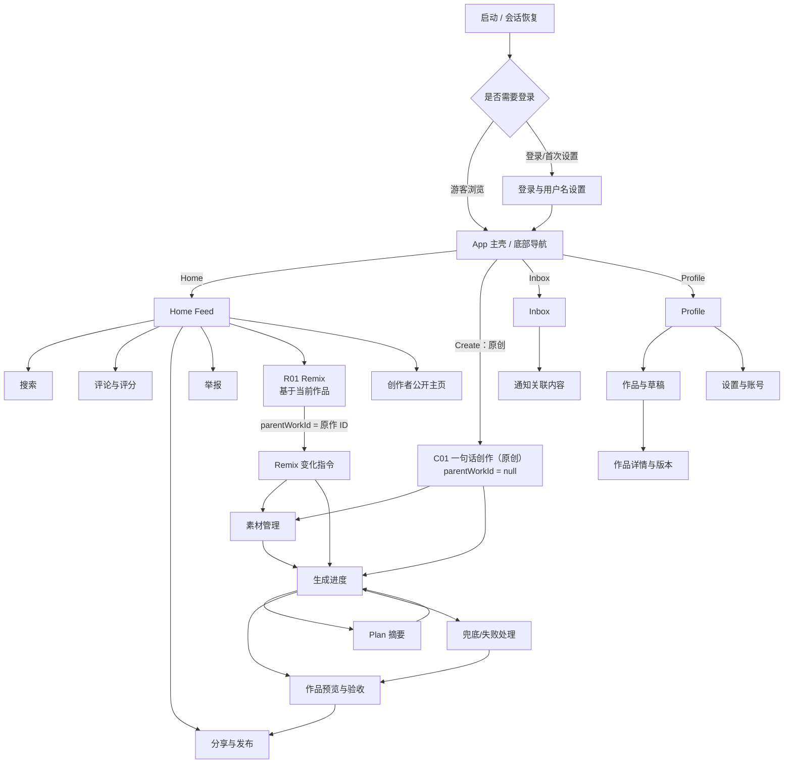
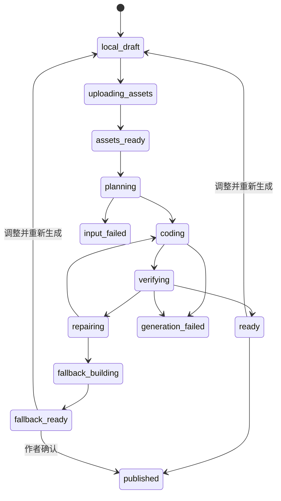

# Pulse 客户端页面设计 PRD

> 文档版本：v1.0
> 文档状态：产品评审稿
> 适用客户端：Pulse iOS（iOS 17+）
> 设计基线：iPhone 15 Pro 画布，适配后续 iPhone 尺寸
> 关联文档：[Pulse 项目方案](../../pulse-api/docs/Pulse项目方案.md)、[Pulse 技术方案](../../pulse-api/docs/Pulse技术方案.md)、[Pulse Coding Agent 技术方案](../../pulse-api/docs/Pulse-Coding-Agent技术方案.md)

## 1. 文档目的

本文将 Pulse iOS 客户端的页面结构、页面目标、信息层级、交互、状态、数据、埋点和验收要求集中到一份可评审 PRD 中，方便产品、设计、客户端、服务端、Agent 平台、测试和内容安全共同确认。

本文不进行人数或日历工期估算。页面进入实现的依据是优先级、前置依赖和验收门禁。

### 1.1 状态标记

| 标记 | 含义 |
| --- | --- |
| `现有原型` | 当前 SwiftUI 代码中已有可运行界面或交互 |
| `P0` | 封闭 Beta 核心闭环必须具备 |
| `P1` | Beta 后增强，不阻塞首次闭环 |
| `P2` | 规模化或商业化阶段再评估 |

### 1.2 本文范围

- App 启动、认证与首次使用。
- Home Feed、作品播放、搜索、评论、分享、举报。
- “一句话 + 图片/视频”创作、Plan、Coding Agent、自动验收、兜底与发布。
- Remix 流程。
- Inbox、Profile、作品/草稿、版本和设置。
- Universal Link 打开作品后的 App 内页面。
- 全局导航、视觉、状态、权限、埋点和无障碍。

不包含后台管理前端和公开 Web Player 的详细页面设计；二者只在与 iOS 跳转、分享或治理相关时说明边界。

## 2. 产品体验目标

### 2.1 核心体验

1. **打开即体验**：用户进入 Home 后无需先理解作品详情，可直接触摸和操作当前作品。
2. **一句话即可独立创作**：用户可从底部 `Create` 直接从零开始原创，不需要先找到或选择现有作品；创作页只要求一句指令，图片和视频是增强输入。
3. **技术过程可理解**：用户看到“素材理解、方案生成、应用构建、自动验收”等产品语言，不暴露命令、容器或模型内部细节。
4. **失败也有结果**：标准产物失败时展示安全兜底预览和差异说明，避免只有模糊错误。
5. **归因始终清楚**：原创作者、直接 Remix 来源和作品版本在消费、创作和分享页面保持一致。
6. **跨端可传播**：发布后的作品可通过公开链接直接试玩，并可回到 App 继续 Remix。

### 2.2 非目标

- 不在 P0 客户端提供源码编辑器、终端、Agent 工具调用明细或完整内部轨迹。
- 不让用户在首次生成前填写复杂技术参数、选择框架或配置依赖。
- 不在 Feed 自动同时运行多个作品。
- 不将 Inbox 私信、多人协作和关注关系作为 P0。
- 不在 iOS 内运行构建工具；客户端只加载已经验收的 Artifact。

## 3. 目标用户与任务

| 用户 | 主要任务 | 页面侧重点 |
| --- | --- | --- |
| 游客体验者 | 浏览、互动、打开分享链接 | 低阻力、快速加载、明确登录触发点 |
| 登录体验者 | 点赞、评论、举报、分享 | 乐观反馈、状态一致、治理入口易找 |
| 轻创作者 | 一句话 + 素材生成作品 | 输入简单、过程透明、失败可恢复 |
| Remix 创作者 | 在原作基础上修改意图和素材 | 归因清楚、继承边界可理解 |
| 作品作者 | 管理草稿、版本、发布与撤销 | 状态准确、风险动作明确、结果可追溯 |

## 4. 信息架构

### 4.1 主导航

底部使用四个固定业务入口：

- **Home**：发现和体验作品。
- **Create**：独立原创入口；不依赖现有作品，也不携带 Remix 血缘。
- **Inbox**：互动通知、作品状态和系统通知。
- **Profile**：个人资料、作品、草稿、链接与设置。

`Create` 是类似 TikTok 的常驻主创作入口：使用独立的加号按钮、荧光描边/填充和高于普通 Tab 的视觉层级，位于底部导航的主视觉位置。从任意 Tab 点击后直接进入 C01“一句话创作”，默认创建原创草稿。它不是 Remix 的快捷方式，也不能继承用户刚浏览作品的 `parentWorkId`。

底部导航需要使用自定义 Tab Bar，而不是简单平均分配系统 Tab：普通入口保持稳定位置，Create 保持显著、可单手触达，并始终显示“一句话创作”的无障碍名称。已有未提交原创草稿时可提示继续或新建，但不得自动切换成 Remix 草稿。

### 4.2 页面关系

### 4.3 导航规则

- Tab 根页面各自维护导航栈；重复点击当前 Tab 返回该 Tab 根页面或顶部。
- 点击底部 Create 始终进入原创 C01；任何浏览中的作品上下文都不能被隐式带入。
- 模态 Sheet 用于评论、分享、举报和轻量 Remix 输入；完整创作、生成进度、预览使用全屏导航。
- Universal Link 打开作品时进入 App 内作品播放页；关闭后回到原导航栈，没有原栈时回到 Home。
- 登录拦截不得丢失用户意图：点赞、评论、Remix、创作或发布在登录成功后恢复到原操作。
- 已删除、隐藏或链接撤销的作品不能静默跳到其他内容，必须展示明确失效页。

### 4.4 原创与 Remix 的产品边界

| 维度 | 一句话原创 | Remix |
| --- | --- | --- |
| 入口 | 底部导航 Create | 现有作品 Action Rail/播放页的 Remix |
| 是否需要现有作品 | 不需要 | 必须有一条可 Remix 的已发布作品 |
| 页面 | C01 | R01，之后复用 C02–C06 |
| `creationMode` | `original` | `remix` |
| `parentWorkId` | 必须为空 | 必须等于入口原作 ID |
| `rootWorkId` | 服务端设为新作品自身 | 服务端从原作血缘派生 |
| 默认素材 | 空；用户自行上传 | 只引用原作允许继承的公开素材，用户可补充自己的素材 |
| 归因展示 | “Original”或无 Remix 标签 | 始终展示“Remix of …”和原创作者 |

两条路径共享素材处理、Plan、Coding Agent、自动验收、预览和发布能力，但入口、血缘、默认上下文和埋点必须分开。

## 5. 页面清单

| ID | 页面 | 优先级 | 当前状态 | 主要入口 |
| --- | --- | --- | --- | --- |
| G01 | 启动与会话恢复 | P0 | 需新增 | App 启动、深链 |
| A01 | Apple 登录 | P0 | 需新增 | 受限操作、Profile、首次创作 |
| A02 | 首次资料设置 | P0 | 需新增 | 首次登录成功 |
| H01 | Home 全屏 Feed | P0 | 现有原型 | Home Tab、App 默认入口 |
| H02 | App 内作品播放页 | P0 | 部分复用 Feed | Universal Link、通知、作品列表 |
| H03 | 搜索 | P1 | 仅有图标 | Home 顶部搜索 |
| H04 | 评论与评分 | P0 | 现有原型 | Feed/播放页评论按钮 |
| H05 | 分享与发布 | P0 | 现有原型，需真实接入 | Feed/预览页分享按钮 |
| H06 | 举报 | P0 | 需新增 | 作品更多菜单、评论更多菜单 |
| H07 | 创作者公开主页 | P1 | 需新增 | 作者头像/名称 |
| C01 | 一句话创作（原创） | P0 | 现有 Prompt 原型 | 底部导航 Create；不从 Remix 进入 |
| C02 | 素材选择与管理 | P0 | 需新增 | C01 添加素材 |
| C03 | 生成进度 | P0 | 需新增 | 提交生成、继续查看任务 |
| C04 | Plan 摘要 | P0 | 需新增 | C03 查看方案 |
| C05 | 作品预览与验收 | P0 | 需新增 | 生成正常/兜底完成 |
| C06 | 生成失败与兜底处理 | P0 | 需新增 | Agent/验证终态 |
| R01 | Remix 输入 | P0 | 现有原型，需升级 | 现有作品的 Feed/播放页 Remix |
| I01 | Inbox 列表 | P1 | 占位页 | Inbox Tab |
| I02 | 通知关联内容 | P1 | 需新增 | Inbox 条目 |
| P01 | 我的 Profile | P0 | 占位页 | Profile Tab |
| P02 | 我的作品与草稿 | P0 | 需新增 | Profile 分段列表 |
| P03 | 作品详情与版本 | P0 | 需新增 | P02 作品条目 |
| P04 | 设置与账号 | P0 | 需新增 | Profile 设置按钮 |
| X01 | 全局失效/不可用页 | P0 | 需新增 | 深链、已撤销内容、版本不兼容 |

## 6. 全局视觉与交互规范

### 6.1 视觉方向

- 主背景为接近纯黑，内容层使用半透明黑、材质模糊和低对比描边。
- 主强调色使用 Pulse Lime；Remix/AI 状态可使用 Violet；风险、失败和点赞使用 Coral/Red，但不能只靠颜色表达状态。
- Feed 作品本身是主视觉，UI 采用覆盖层，避免大面积卡片遮挡互动区域。
- 标题使用圆角、紧凑、较强字重；正文保持高可读性，避免荧光色承载长段正文。
- 图标优先使用 SF Symbols；关键操作同时有文本或无障碍标签。
- 动效用于表达触摸响应、生成阶段切换和成功状态，不用于遮掩等待或制造虚假进度。

### 6.2 设计 Token 建议

| Token | 建议值/语义 |
| --- | --- |
| `surface.base` | `#050505` |
| `accent.primary` | Pulse Lime，约 `#B4FF14` |
| `accent.ai` | Pulse Violet，约 `#9452FF` |
| `accent.danger` | Pulse Coral，约 `#FF596F` |
| `text.primary` | 白色高强调 |
| `text.secondary` | 白色中等透明度 |
| `border.subtle` | 白色低透明度 |
| `radius.card` | 中到大圆角，按容器层级统一 |
| `radius.action` | 胶囊或圆形 |

最终颜色和尺寸以设计系统文件为准；本文定义语义而非替代视觉稿。

### 6.3 安全区域与响应式

- Feed 和播放内容可延伸到全屏，但顶部标题、操作栏和底部 Tab 必须避让 Safe Area。
- 主交互目标不能被 Home Indicator、Dynamic Island、键盘或底部 Tab 遮挡。
- 小尺寸设备优先保证作品互动区、主 CTA 和错误信息；非关键说明可折叠。
- 横屏作品由 Artifact 声明支持能力；不支持时锁定竖屏或显示旋转提示。
- 大字体模式下允许内容滚动，不通过缩小字体强行塞入。

### 6.4 无障碍

- 每个按钮提供用途明确的 Accessibility Label，计数与动作合并朗读。
- 动态 Canvas/Web 作品提供作品名称、互动说明和静态预览兜底。
- 支持 Reduce Motion；作品无法降级时暂停非必要动画并说明。
- 支持 VoiceOver 顺序：页面标题 → 作品说明 → 主操作 → 次操作 → 导航。
- 评分控件可直接选择具体分值，不能只依赖横向手势。
- 颜色状态同时使用图标、文本或形状表达。

## 7. 全局页面状态

### 7.1 通用状态

每个读取型页面必须定义：

- **首次加载**：骨架或品牌加载态，不显示错误计数和空数据闪烁。
- **刷新**：保留现有内容，局部展示刷新状态。
- **空状态**：说明为什么为空，并给出唯一主行动。
- **可恢复错误**：简洁错误、重试按钮和保留已有内容。
- **不可恢复错误**：明确下一步，如返回、联系支持或重新生成。
- **离线**：显示缓存内容和离线标识；禁止误报发布/评论成功。
- **权限受限**：说明需要登录、媒体库权限或作者身份。
- **内容失效**：下架、删除、撤销、版本不兼容分别映射到用户可理解文案。

### 7.2 写操作反馈

- 点赞等低风险操作可乐观更新，失败后回滚并轻提示。
- 评论、发布、撤销、删除等操作以服务端确认作为成功依据。
- 所有提交按钮在请求中防重复触发；幂等键由客户端请求层管理。
- 破坏性操作使用确认页或确认弹窗，展示对象名称和影响范围。
- 不能用无限旋转指示器代替状态；长任务进入 C03 可离开页面并继续后台处理。

## 8. 页面详细设计

### G01 启动与会话恢复

**目标：** 恢复用户会话、远程配置和深链目标，在无法恢复时安全进入游客模式或登录。

**页面结构：**

- 黑色背景与 Pulse 标识。
- 不展示虚构百分比。
- 若遇到必须处理的问题，切换为品牌化错误状态，而不是停留在启动图。

**核心逻辑：**

1. 读取本地会话和最小缓存。
2. 获取必要 Feature Flag、最低客户端版本和服务可用状态。
3. 有深链时保留目标作品 slug。
4. 会话有效则进入目标页面或 Home；会话失效但目标公开则以游客打开；受限目标进入 A01。

**状态：** 正常、离线缓存、会话刷新失败、强制升级、服务维护、深链无效。

**验收：**

- 会话失败不会造成启动死循环。
- 深链目标在登录前后保持一致。
- 强制升级与维护状态具有明确行动。

### A01 Apple 登录

**目标：** 在不打断游客浏览的前提下，为点赞、评论、创作、Remix、发布和 Profile 提供身份。

**入口：** Profile Tab；游客执行受限操作；首次创作；被撤销的 Refresh Token。

**页面结构：**

- Pulse Logo 与一句价值说明。
- “通过 Apple 继续”主按钮。
- 用户协议、隐私政策和 AI 生成内容说明链接。
- “暂时浏览”次行动，仅在入口允许游客返回时显示。

**交互：**

- 登录成功：已有用户恢复原操作；新用户进入 A02。
- 用户取消：回到原页面，不显示错误告警。
- 验证失败：显示可重试错误，不暴露 Token 或供应商细节。

**埋点：** `auth_viewed`、`auth_started`、`auth_cancelled`、`auth_succeeded`、`auth_failed`，携带 `entryPoint`，不携带身份令牌。

### A02 首次资料设置

**目标：** 建立可公开展示的用户名和展示名。

**页面结构：**

- 头像选择，可跳过。
- 用户名：唯一、规范化、实时提示可用性。
- 展示名：可与用户名不同。
- 完成主按钮。

**规则：**

- 用户名格式、长度、保留词和审核规则由服务端权威返回。
- 用户名冲突提供可解释建议，不自动替用户提交其他名称。
- 完成前退出时保留安全草稿；再次进入继续设置。

**验收：** 不能通过客户端绕过敏感词、唯一性或保留用户名限制。

### H01 Home 全屏 Feed

**状态：** `现有原型`，P0 需要数据接入和完整状态。

**目标：** 让用户无需进入详情即可连续发现和体验互动作品。

**页面布局：**

- 顶部：Pulse 品牌；搜索入口；可选当前用户头像。
- 中央：当前作品互动运行区，占据主要屏幕。
- 左下：Prompt/一句话意图、作品标题、作者、主题描述、Remix 归因。
- 右侧 Action Rail：作者、点赞、评论、Remix、分享；计数使用紧凑格式。
- 底部：半透明胶囊四 Tab。
- 背景：作品实时渲染；上下使用渐变保证文字对比度。

**核心交互：**

- 纵向分页切换作品，一次只激活当前作品。
- 在互动区点击、拖动、长按等行为交给作品；页面滑动与作品手势冲突由运行时协议处理。
- 点赞乐观更新；评论打开 H04；Remix 打开 R01；分享打开 H05。
- 点击作者进入 H07；点击作品标题进入 H02 或展示详情层。
- 作品音频必须由用户动作启用，离屏后暂停。

**Feed 预取：**

- 预取下一作品元数据、预览图和受限资源。
- 不同时启动多个 Web Bundle/Canvas。
- 当前作品失败时显示静态预览和“重新加载”，不阻塞滑到下一条。
- 已发布作品存在 `artifactId`/`artifactEntryUrl` 时，由客户端 Artifact Player 直接加载服务端不可变 Bundle；底部保留交互安全区，生成作品的触控目标不得落入 Pulse Tab Bar 命中区域。

**状态：**

- 首屏骨架、正常、分页加载、Feed 空、离线缓存、作品资源失败、Artifact 不兼容、作品被下架。
- Feed 空状态主行动为“去创作”；游客可先展示官方种子作品。

**关键埋点：**

- `feed_impression`：作品达到可视标准。
- `play_started`：首次有效作品交互。
- `meaningful_play`：达到产品配置的有效体验条件。
- `feed_swiped`、`like_toggled`、`comments_opened`、`remix_opened`、`share_opened`。

**验收：**

- Action Rail 不遮挡作品主要交互目标。
- 切换作品后上一作品动画、音频和定时器停止。
- 网络失败不会清空已有 Feed。
- 服务端计数返回后修正客户端乐观值。

### H02 App 内作品播放页

**目标：** 从深链、通知、Profile 或作品列表打开单个作品，并提供比 Feed 更稳定的上下文。

**布局：**

- 顶部返回、作品状态/来源、更多菜单。
- 中央全屏或适配比例的 Artifact Host。
- 可折叠信息层：标题、作者、Prompt、说明、版本、Remix 来源。
- 底部操作：点赞、评论、Remix、分享。

**与 Feed 差异：**

- 不支持纵向切换其他作品。
- 信息层可展开查看血缘和版本。
- 深链失效进入 X01，不回退到随机 Feed。

**状态：** 公开作品、作者预览草稿、fallback 预览、下架、撤销、版本不兼容、离线缓存。

### H03 搜索

**优先级：** P1。

**目标：** 搜索作品、作者和主题，而不干扰 Home 的沉浸体验。

**页面结构：**

- 搜索框与取消。
- 输入前：最近搜索、推荐主题，可配置关闭。
- 输入后分段：作品、创作者、主题。
- 作品结果使用静态预览卡片，不自动运行互动内容。

**状态：** 未输入、联想、结果、无结果、错误、离线最近结果。

**规则：** 搜索历史默认仅保存在本地；敏感查询不写普通分析事件。

### H04 评论与评分

**状态：** `现有原型`，P0 接入真实 API。

**呈现：** 从 Feed/播放页以 Bottom Sheet 打开，可向上扩展为全屏。

**结构：**

- 标题与可见评论数。
- 评论列表：头像、用户名、1–5 分、正文、发布时间语义、更多菜单。
- 空状态：“成为第一个评论的人”。
- 底部输入：评分选择、评论正文、发送。

**交互规则：**

- 游客聚焦输入时进入 A01，登录后恢复草稿。
- 正文去除首尾空白；服务端控制长度和内容审核。
- 发送成功后插入顶部并使用服务端评论实体。
- 作者可删除自己的评论；其他用户可举报；运营隐藏后计数以服务端为准。

**状态：** 加载、分页、空、提交中、审核中、提交失败、评论被隐藏、评论已删除。

**验收：**

- 重复提交不产生重复评论。
- 评分可被 VoiceOver 精确选择。
- 关闭 Sheet 后 Feed 计数同步更新。

### H05 分享与发布

**状态：** `现有原型`，需移除固定预览 URL。

**场景 A：分享已发布作品**

- 展示公开 URL 域名、分享预览卡和系统 ShareLink。
- 操作：复制链接、系统分享、打开 Web 预览、举报异常链接。

**场景 B：作者发布草稿/新版本**

- 展示作品标题、验证等级、公开后可见信息、Remix 权限。
- `verified`：允许直接发布。
- `degraded`：展示降级项，由产品策略决定是否允许作者确认发布。
- `fallback`：明确“安全简化版”，必须作者确认后才能公开。
- 硬门禁失败：不展示发布按钮，跳转 C06。

**场景 C：撤销公开**

- 仅作者/管理员可见。
- 确认内容说明公开链接将失效，作品草稿和历史记录仍保留。

**验收：**

- 发布成功使用服务端真实 URL。
- 重复点击不创建多个公开版本。
- 撤销后客户端不继续显示“已公开”。

### H06 举报

**目标：** 为作品和评论提供低摩擦但可审计的治理入口。

**页面结构：**

- 被举报对象摘要。
- 单选原因：不当内容、版权、冒充、垃圾信息、安全问题、其他。
- 可选补充说明。
- 提交按钮与匿名性说明。

**规则：**

- 仅登录用户提交；登录后恢复待举报对象。
- 同一用户重复举报返回已有处理状态，不制造重复记录。
- 举报成功只确认已收到，不承诺处理结果。

### H07 创作者公开主页

**优先级：** P1。

**结构：** 头像、用户名、展示名、简介、公开作品、Remix、作品统计；关注能力不属于 P0。

**规则：** 只显示已发布且未隐藏作品；删除账号按隐私策略去标识化。

### C01 一句话创作（原创）

**状态：** 当前只有 Prompt 输入原型；目标为 P0 核心页面。

**入口：** 底部导航常驻 Create 主按钮。用户不需要先浏览、选择或 Remix 任一作品。

**目标：** 用户从零开始，只输入一句创作指令即可创建原创互动应用；素材作为可选增强，不暴露技术配置。

**模式约束：** C01 只表示 `creationMode = original`。页面不得显示“Remix of”原作卡片，不得从当前 Feed 自动继承标题、Prompt、素材或 `parentWorkId`。Remix 使用独立 R01 页面。

**页面结构：**

- 标题：“Make something people can feel.” 或本地化文案。
- 原创标识或文案：“从一句话开始创作”，避免与 Remix 混淆。
- 主输入框：支持多行，默认提供示例但不替用户自动提交。
- 资源区：公共/私有资源库入口、已选图片/BGM/视频列表、上传入口和状态标识。
- 灵感 Chips：互动相册、小游戏、故事、音乐花园等，仅填充建议，不直接开始。
- “生成互动应用”主按钮。
- 最近草稿/进行中的生成任务入口。

**输入规则：**

- 指令必填；素材选填。
- 不要求用户选择框架、颜色、模型或技术参数。
- 输入与素材在提交前只保存为私有草稿。
- 素材仍在上传/处理时，主按钮展示不可提交原因，而不是无反馈禁用。

**提交：**

1. 未登录进入 A01，成功后恢复指令和素材草稿。
2. 检查素材状态与用户生成额度。
3. 以 `creationMode = original` 创建 Work 草稿，服务端确认 `parentWorkId = null`，再创建 Generation Job。
4. 进入 C03；不等待任务完成。

**埋点：** `create_viewed`、`instruction_edited`、`asset_add_started`、`generation_submitted`；完整指令不进入普通埋点。

**验收：**

- App 退出或登录往返不会丢失未提交草稿。
- 连续点击只产生一个 Job。
- 不支持的素材在选择后立即给出原因和替代建议。
- 从任意 Tab 点击 Create 都能进入 C01，不要求存在原作品。
- 即使用户刚在 Feed 浏览过作品，原创请求也不携带该作品 ID、Plan、素材或血缘。

### C02 素材选择与管理

**目标：** 从资源库选择或上传图片/BGM/视频，使用户知道哪些资源会进入生成以及资源的公开性和来源。

**入口：** C01 原创素材添加；R01 Remix 补充素材；失败页替换不可用素材。

**页面结构：**

- 顶部公共/私有分段选择：公共资源库由 Pulse 官方提供，展示许可说明；私有资源库只展示当前用户上传资源。
- 公共库优先提供图片包和可循环 BGM；支持按图片/BGM/视频类型筛选。
- 系统 PhotosPicker 上传私有图片/视频；Files Picker 上传私有 BGM，不申请全量媒体权限。
- 已选素材网格/列表：缩略图、类型、文件状态、删除、排序、用途可选标签。
- 单素材预览：图片缩放；BGM 试听、时长和循环提示；视频播放和封面；处理失败原因。
- 权限说明：只请求用户明确选择的媒体，不要求全量照片库权限。

**素材状态：**

- `local`：仅本地选择。
- `uploading`：显示真实字节进度和取消。
- `processing`：扫描、转码、抽帧或理解中，使用统一产品文案。
- `ready`：可以绑定 Generation Job。
- `rejected`：内容/格式不允许；提供删除或替换。
- `failed`：可重试技术错误。

**规则：**

- 删除未提交素材同时取消上传；已经绑定历史 Job 的素材只从当前草稿解绑。
- 原创和 Remix 可以同时选择公共资源与当前用户私有资源；Remix 不展示或继承原作者私有资源。
- 公共资源只显示官方审核通过且当前版本可用的条目；私有资源 ID 必须由服务端再次校验所有者，客户端不以隐藏列表代替鉴权。
- 视频不自动播放声音。
- BGM 只在用户主动试听或应用内明确交互后播放，离开选择器和作品后停止。
- 上传使用由 Go API 签发的阿里云 OSS 短时 PUT URL，客户端不持有 AccessKey，也不展示 Bucket、对象 Key、存储路径或内部 ID；OSS 上传成功但服务端校验未完成时不得显示为可用资源。
- 官方公共资源可通过 `cdn.ai.lovetalk.chat` 加载缩略图、图片和 BGM；私有资源预览必须使用 API 返回的短时授权地址，客户端不得自行拼接 CDN URL。
- 原始素材、规范化素材和理解结果的保留政策在隐私说明中可查。

### C03 生成进度

**目标：** 将长任务转化为可离开、可恢复、可理解的阶段状态。

**用户可见阶段：**

| 产品阶段 | 对应技术阶段 | 用户展示内容 |
| --- | --- | --- |
| 正在理解素材 | 上传完成、媒体处理、多模态理解 | 正在分析图片主体、视频片段和声音 |
| 正在制定方案 | Plan Generator | 展示计划标题和素材使用摘要 |
| 正在构建应用 | Agent Stage 0–3 | 展示已完成的页面/交互摘要，不展示思维链 |
| 正在自动验收 | Verifier Stage 4 | 展示构建、加载、交互、安全等检查类别 |
| 正在自动修复 | Repair Loop | 展示正在修复的用户可理解问题类别 |
| 正在准备安全版本 | Fallback | 明确标准版本未通过，正在生成简化可用版本 |
| 可预览 | Artifact Ready | 跳转 C05 |

**页面结构：**

- 作品临时标题、指令摘要、素材缩略图。
- 当前阶段图标、标题、说明和已完成阶段列表。
- “查看项目方案”入口，Plan 完成后可用。
- “离开并在后台继续”说明；返回键不取消任务。
- 取消生成放在更多菜单并二次确认。

**进度原则：**

- 不展示模型伪造百分比；只展示真实阶段和可计数的验证项。
- SSE/轮询断开时显示“正在重新连接”，不把任务标记失败。
- App 重启后通过 Job ID 恢复当前状态。
- 阶段失败映射到 C06；平台暂时故障和输入拒绝使用不同文案。

**埋点：** `generation_stage_viewed`、`plan_opened`、`generation_backgrounded`、`generation_cancelled`、`artifact_ready_viewed`。

### C04 Plan 摘要

**目标：** 让产品和用户理解系统准备做什么，同时保持“一句话自动生成”不被确认步骤阻塞。

**呈现：** 从 C03/C05 打开只读页面；Plan 生成完成后 Agent 自动继续，不等待用户确认。

**结构：**

- 项目目标。
- 页面/场景清单。
- 核心交互规则。
- 素材使用映射：缩略图/视频片段 → 用途。
- 验收摘要：关键交互需要满足什么。
- 安全与能力限制。
- Plan 版本和本次生成关系。

**操作：**

- “基于这个方案修改”创建新指令版本和新 Generation Job。
- “查看素材”回到只读素材列表。
- 不提供直接修改 `plan.json`、框架或验证规则的入口。

**安全：** 不显示系统提示词、内部模型参数、隐藏推理、源码、对象存储地址或完整 Agent 轨迹。

### C05 作品预览与验收

**目标：** 在发布前让作者真实试玩产物、理解验收等级并选择发布或继续修改。

**页面布局：**

- 顶部：返回、作品临时标题、更多。
- 中央：全尺寸 Artifact Host，使用与线上相同的隔离策略。
- 底部可折叠面板：验收等级、通过项、降级项、素材使用、Plan 入口。
- 固定主操作：“发布”；次操作：“调整并重新生成”；更多：“保存草稿”“删除草稿”。

**验收摘要：**

- `verified`：绿色/荧光成功标识，显示关键交互均通过。
- `degraded`：显示可用但存在的非关键降级项。
- `fallback`：明确为“安全简化版”，展示相对 Plan 被简化的功能。
- 不向普通用户展示内部堆栈、命令行或安全检测规则。

**交互：**

- 预览每次从可复现初始状态开始；提供“重置体验”。
- C05 与 Feed 复用同一个 Artifact Player 和同一 Artifact URL 解析规则；加载、失败、重试状态由宿主展示，作品内部交互仍由 Bundle 自身处理。
- 发布进入 H05 场景 B。
- 修改保留原指令、素材和 Plan，引导用户输入变化点，创建新版本。
- fallback 不自动发布，必须作者确认。

**验收：**

- 预览使用的 Artifact ID 与发布的版本一致。
- 验收等级和报告来自服务端，不由客户端推断。
- 预览 Web Bundle 无法读取 Pulse Token、Cookie 或宿主页面信息。

### C06 生成失败与兜底处理

**目标：** 根据失败类型提供下一步，避免统一显示“生成失败”。

**场景：**

#### A. 安全兜底已就绪

- 标题：“已为你准备一个可用的简化版本”。
- 展示标准版本未通过的用户可理解原因类别。
- 操作：预览简化版、修改指令重试、替换素材、查看 Plan。

#### B. 输入/素材问题

- 指出具体不可用素材或超出能力的需求。
- 操作：删除/替换素材、修改指令；保留其他输入。

#### C. 平台暂时不可用

- 说明作品和素材已保存。
- 操作：重试、稍后在草稿中继续；不重复扣减额度。

#### D. 内容或安全拒绝

- 使用政策级可公开原因，不暴露检测细节。
- 提供社区规范/申诉入口；禁止通过重复重试绕过。

**规则：** 失败报告必须带 `errorCategory`、是否可重试、额度处理和可用产物；客户端不解析内部异常字符串。

### R01 Remix 输入

**状态：** `现有原型`，需升级为一句话 + 可选素材。

**入口：** 只能从一个具体、已发布且允许 Remix 的作品点击 Remix 进入。

**呈现：** 从原作打开 Sheet；提交后直接进入共用的 C02/C03 生成流程，不经过原创 C01，避免丢失或混淆血缘。

**结构：**

- 原作品预览、标题、作者和“Remix of”归因。
- 继承内容摘要：原作公开 Plan/Artifact 能力、允许复用的公开素材。
- 变化指令输入：“你希望它变成什么样？”
- 从公共资源库或自己的私有资源库添加图片/BGM/视频，也可上传新私有资源。
- “创建 Remix”主按钮。

**规则：**

- 服务端验证原作已发布且允许 Remix。
- 请求必须使用 `creationMode = remix`，并携带当前入口原作的 `parentWorkId`；缺少父作品时拒绝创建。
- 客户端不能修改原创作者、根作品和血缘字段。
- 默认不向 Remix 作者暴露原作私有素材、源码、系统提示词或内部 Plan。
- 原作在提交前失效时停止并说明原因。
- 用户选择“从零开始”时退出 R01 并打开 C01，创建新的原创草稿，不能保留 `parentWorkId`。

### I01 Inbox 列表

**优先级：** P1；当前为占位页。

**目标：** 汇总需要用户关注的互动和作品状态，不承担实时聊天。

**分类：**

- 作品：生成完成、fallback 可预览、审核状态、发布异常。
- 互动：评论回复、作品被 Remix、重要点赞里程碑。
- 系统：账号、安全、政策和服务通知。

**结构：** 分段筛选、未读标识、标题、摘要、关联作品预览、语义时间、批量已读。

**规则：**

- 点击条目进入 I02 关联页面。
- 已删除作品通知仍可打开解释页，但不加载内容。
- 推送通知只显示必要摘要，敏感审核原因需进入 App 查看。

### I02 通知关联内容

**优先级：** P1。

根据通知类型路由：生成完成 → C05；fallback → C06；评论 → H04 指定评论；Remix → H02；审核/发布问题 → P03 状态详情。

失效目标展示 X01，并保留通知本身的安全摘要。

### P01 我的 Profile

**优先级：** P0；当前为占位页。

**结构：**

- 头像、用户名、展示名、简介编辑入口。
- 统计：公开作品、Remix、获赞；计数以服务端为准。
- 分段：作品、Remix、草稿。
- 设置按钮。
- 游客状态展示登录价值和 A01 入口。

**规则：**

- 草稿仅本人可见。
- Profile 首屏不自动运行所有作品，使用静态预览卡。
- fallback 草稿使用明确角标，公开后按正常作品展示但作者详情中保留版本等级。

### P02 我的作品与草稿

**目标：** 管理不同状态的作品和继续未完成任务。

**筛选：** 全部、已发布、草稿、生成中、需要处理、已撤销。

**卡片字段：** 预览图、标题、状态、当前版本、更新时间语义、公开/私有、验证等级、失败/兜底摘要。

**操作：**

- 生成中 → C03。
- 可预览 → C05。
- 已发布 → H02/P03。
- 需要处理 → C06。
- 左滑/更多菜单只提供与状态匹配的动作，不在列表直接执行永久删除。

**空状态：** 草稿为空时主行动“创建第一个互动应用”。

### P03 作品详情与版本

**目标：** 让作者理解作品当前公开状态、版本、生成来源和可执行管理动作。

**结构：**

- 作品预览、标题、Prompt、作者、血缘。
- 状态：草稿/生成中/已发布/已撤销/隐藏。
- 当前公开版本与草稿版本。
- 版本列表：版本号、来源 Job、验证等级、是否公开。
- 统计：播放、点赞、评论、Remix；分析详情为 P1。
- 操作：预览、分享、撤销公开、创建新版本、Remix、删除。

**规则：**

- 切换公开版本必须走发布门禁，不能直接把任意历史 Artifact 设为公开。
- 删除优先软删除，并展示对公开链接和 Remix 归因的影响。
- 运营隐藏状态不允许作者自行重新发布，显示申诉/了解原因入口。

### P04 设置与账号

**P0 分组：**

- 账号：资料、Apple 登录状态、退出、删除账号。
- 创作：默认声音、允许 Remix 默认值、生成额度摘要。
- 播放：声音、降低动态效果、流量/资源偏好。
- 隐私：素材与生成数据说明、分析数据选择、数据导出/删除入口。
- 支持：帮助、社区规范、反馈、版本信息。

**规则：**

- 退出登录清除 Keychain 会话和身份相关待提交操作，但不误删服务器数据。
- 删除账号使用独立确认流程，说明作品和 Remix 归因处理。
- 不显示或允许复制访问令牌、内部用户 ID 或调试配置。

### X01 全局失效/不可用页

**目标：** 为无法展示的目标提供明确而安全的终态。

**原因映射：**

- 作品不存在或已删除。
- 作者撤销公开链接。
- 内容被隐藏。
- 当前客户端不支持 Artifact 版本。
- 网络不可用且无缓存。
- 用户没有草稿/管理权限。

**页面结构：** 原因标题、可公开说明、主行动和安全返回路径。禁止展示内部错误、审核规则或其他私有作品信息。

## 9. 创作状态机与页面映射

| 状态 | 主页面 | 可离开 | 主行动 |
| --- | --- | --- | --- |
| `local_draft` | C01/C02 | 是 | 提交生成 |
| `uploading_assets` | C02 | 是 | 查看/取消上传 |
| `planning`/`coding` | C03 | 是 | 后台继续 |
| `verifying`/`repairing` | C03 | 是 | 查看验证阶段 |
| `ready` | C05 | 是 | 发布或修改 |
| `fallback_ready` | C06/C05 | 是 | 预览并确认 |
| `input_failed` | C06 | 是 | 修改输入/素材 |
| `generation_failed` | C06 | 是 | 重试或查看草稿 |
| `published` | H02/P03/H05 | 是 | 分享/管理 |

## 10. 权限与登录拦截

| 操作 | 游客 | 登录用户 | 作者 |
| --- | --- | --- | --- |
| 浏览公开 Feed/作品 | 允许 | 允许 | 允许 |
| 搜索公开内容 | 允许 | 允许 | 允许 |
| 点赞/评论/举报 | 登录拦截 | 允许 | 允许 |
| 一句话创作 | 登录拦截 | 允许 | 允许 |
| Remix | 登录拦截 | 允许，受原作权限限制 | 允许，受原作权限限制 |
| 查看草稿/Plan/验收报告 | 禁止 | 仅自己的 | 允许自己的 |
| 发布/撤销/删除 | 禁止 | 仅自己的 | 允许自己的 |

登录拦截统一携带 `PendingIntent`：操作类型、目标 ID、安全草稿引用和返回页面。登录完成后重新向服务端校验权限，不能仅恢复客户端按钮动作。

## 11. API 与页面映射

| 页面 | 主要接口/数据 |
| --- | --- |
| G01/A01/A02 | `/v1/auth/apple`、`/v1/auth/refresh`、`/v1/me` |
| H01 | `/v1/feed`、Artifact Manifest、CDN Bundle/资源 |
| H02/H07 | `/v1/works/:id`、`/v1/public/works/:slug`、用户公开资料 |
| H04 | `/v1/works/:id/comments`、`/v1/comments/:id` |
| H05 | `/v1/works/:id/publish`、`/unpublish`、公开 URL |
| H06 | `/v1/reports` |
| C01/C02 | `/v1/assets/uploads`、上传完成、`/v1/assets/:id` |
| C03/C04 | `/v1/works/:id/generations`、Job 状态/SSE、Plan 摘要 |
| C05/C06 | Artifact、Verification 摘要、重试/新 Job |
| R01 | 原作详情、lineage、创建 Remix Work/Generation |
| I01/I02 | 通知列表、已读、关联资源；P1 定义具体 API |
| P01/P02/P03 | `/v1/me`、`/v1/me/works`、作品详情、版本和发布状态 |
| P04 | 用户资料、会话、数据导出/账号删除 |

页面只消费面向客户端的脱敏模型；Agent 完整 StepEvent、源码、系统提示词和安全报告不进入普通客户端接口。

## 12. 埋点规范

### 12.1 公共字段

- `eventVersion`、`platform`、`appVersion`。
- `sessionId`、匿名/登录态标识；用户标识按隐私方案哈希或受控处理。
- `workId`、`versionId`、`artifactType`、`verificationGrade`，仅在相关事件中出现。
- `entryPoint`、`screenId`、`previousScreenId`。
- 不记录认证令牌、完整 Prompt、评论正文、Plan 全文、素材内容或内部错误堆栈。

### 12.2 核心页面事件

| 页面 | 事件 |
| --- | --- |
| H01/H02 | `work_impression`、`play_started`、`meaningful_play`、`play_failed` |
| H04 | `comments_opened`、`comment_submit_started/succeeded/failed` |
| H05 | `publish_started/succeeded/failed`、`share_invoked`、`unpublish_succeeded` |
| C01/C02 | `create_viewed`、`asset_selected/uploaded/rejected`、`generation_submitted` |
| C03 | `generation_stage_viewed`、`plan_opened`、`generation_cancelled` |
| C05/C06 | `preview_started`、`verification_summary_opened`、`fallback_previewed`、`regenerate_started` |
| R01 | `remix_started`、`remix_generation_submitted` |
| P02/P03 | `draft_resumed`、`version_opened`、`work_management_action` |

### 12.3 口径原则

- 页面曝光和作品有效体验分开统计。
- `verified`、`degraded`、`fallback` 和 `failed` 分开统计，禁止合并为“生成成功”。
- 客户端事件不是发布、计数和权限的事实来源；服务端业务事件为权威口径。
- 埋点失败不得阻塞播放、创作或发布。

## 13. 文案原则

- 面向用户使用“应用构建”“自动验收”“正在修复”“安全简化版”，避免“容器、Tool Call、TypeScript Error”等工程术语。
- 错误说明包含发生了什么、输入是否保留、额度如何处理、用户下一步。
- 不使用“马上”“很快”等不可保证承诺。
- 内容安全拒绝不披露可被用于绕过规则的检测细节。
- fallback 文案不能伪装成标准产物，也不能暗示用户操作错误。
- 登录、隐私、素材和公开发布文案需通过法务/隐私评审。

## 14. PRD 验收清单

### 导航与页面

- [ ] 四 Tab、Sheet、全屏流程和 Universal Link 返回路径一致。
- [ ] 底部导航常驻显著 Create 主按钮，从 Home、Inbox、Profile 均可一键进入 C01 原创。
- [ ] 底部 Create 不依赖当前作品，也不会把当前 Feed 作品隐式转换成 Remix。
- [ ] 页面清单中的所有 P0 页面有加载、空、错误、离线和权限状态。
- [ ] 登录拦截后能安全恢复点赞、评论、创作、Remix 和发布意图。
- [ ] 失效作品不跳转到无关内容。

### 消费与互动

- [ ] Feed 同时只激活当前作品，离屏后停止音频/动画/定时器。
- [ ] 点赞、评论、分享和计数与服务端状态一致。
- [ ] 评论评分、Action Rail 和作品运行区通过 VoiceOver/大字体检查。

### 一句话生成

- [ ] 原创和 Remix 是两个独立入口：原创走底部 Create/C01；Remix 走现有作品/R01。
- [ ] 原创请求的 `parentWorkId` 必须为空；Remix 请求必须有经过服务端验证的 `parentWorkId`。
- [ ] 指令是唯一必填创作信息，图片/BGM/视频为可选资源。
- [ ] 原创与 Remix 均可选择官方公共资源和当前用户私有资源；任何流程都不能读取其他用户私有资源。
- [ ] 素材上传、处理、拒绝和重试状态可理解且不丢草稿。
- [ ] Plan 自动进入 Agent，不要求用户完成额外技术配置。
- [ ] C03 展示真实阶段而非虚构百分比，离开后任务继续并可恢复。
- [ ] Agent Finish 不等于客户端成功；C05 只展示服务端验收等级。
- [ ] 标准、degraded、fallback 和 failed 的页面、文案和主行动明确不同。
- [ ] fallback 必须作者确认后才能发布。

### 作品管理与安全

- [ ] 预览 Artifact 与最终发布版本一致。
- [ ] Feed 与 C05 使用真实 Artifact Player，主交互目标不被 Pulse 底部导航遮挡。
- [ ] Web Bundle 预览无法访问 Pulse Token、Cookie、宿主 DOM 或未授权网络。
- [ ] 撤销、删除、举报、账号删除等高风险动作展示影响范围并由服务端确认。
- [ ] 普通客户端不暴露源码、完整 Agent 轨迹、系统提示词和内部安全报告。

### 数据与埋点

- [ ] 关键漏斗事件、字段和服务端权威口径已对齐。
- [ ] 普通埋点不包含完整 Prompt、素材内容、评论正文、Plan 全文或身份令牌。
- [ ] `verified`、`degraded`、`fallback` 和 `failed` 可分别分析。

## 15. 产品待决策项

1. 游客是否能完整体验所有公开作品，还是部分作品需要登录。
2. 底部 Create 的最终视觉形态采用凸起按钮、双色描边还是实心荧光按钮；其原创语义和常驻位置不作为待决策项。
3. Home 顶部显示用户头像还是只保留搜索入口。
4. Search 是否进入 P0；当前建议 P1。
5. `degraded` 作品达到什么产品条件可以发布。
6. fallback 发布后是否在公开页面显示可见标记；当前建议作者侧明确、消费侧按内容体验展示。
7. Plan 摘要允许用户看到的技术限制粒度。
8. 创作页允许选择的图片/视频数量、总资源配额和支持格式。
9. 生成额度如何展示，以及平台失败、内容拒绝和用户取消如何处理额度。
10. 作者是否可默认关闭 Remix，以及新账号的默认值。
11. Inbox 是否只做作品/互动通知，还是加入私信；当前 P1 仅定义通知。
12. Profile 是否展示播放量等创作者数据；当前 P0 只展示基础公开统计。
13. 账号删除后原作、公开链接和已有 Remix 的归因展示策略。

## 16. 现有代码对应关系

| 页面/能力 | 当前代码 | PRD 动作 |
| --- | --- | --- |
| App 根导航 | `../../pulse-ios/Pulse/App/PulseApp.swift` | 保留四 Tab，补认证、深链和各 Tab 导航栈 |
| 全局本地状态 | `../../pulse-ios/Pulse/App/AppModel.swift` | 迁移为 Session/Repository/Feature State，种子数据仅用于 Preview |
| 底部 Tab | `../../pulse-ios/Pulse/Design/AppTabBar.swift` | 保留视觉方向，补大字体、安全区域和 Tab 恢复 |
| Home Feed | `../../pulse-ios/Pulse/Features/Feed/FeedView.swift` | 接入真实 Feed、Artifact Host、状态和埋点 |
| SwiftUI 互动 Canvas | `../../pulse-ios/Pulse/Features/Feed/LivingCanvas.swift` | 作为 Platform Manifest/种子作品 Renderer；增加 Web Bundle Host |
| 评论 | `../../pulse-ios/Pulse/Features/Feed/CommentsSheet.swift` | 接 API、分页、审核、删除和举报 |
| 创作/Remix | `../../pulse-ios/Pulse/Features/Composer/RemixSheet.swift` | 拆分 C01–C06 和 R01，接入素材、Plan、Agent 状态与预览 |
| 分享 | `../../pulse-ios/Pulse/Features/Share/ShareSheet.swift` | 删除固定 URL，接真实发布、撤销和系统分享 |
| API Client | `../../pulse-ios/Pulse/Domain/PulseAPIClient.swift` | 拆分认证、Feed、素材、Generation、作品与互动 Repository |
| 视觉概念图 | `../../pulse-ios/docs/design-feed-concept.png` | H01 视觉基线 |

## 17. 结论

Pulse 客户端应将复杂的多模态理解和 Coding Agent 流程压缩为简单、可信的产品体验：用户在 Home 直接玩，在 Create 输入一句话并可选素材，在生成进度中看到真实阶段，在预览中看到服务端权威验收等级，在失败时仍获得明确的修改或安全兜底路径。页面设计的核心审核标准不是页面数量，而是消费、创作、验收、发布和管理状态能否无歧义地闭环，并且始终保护身份、素材和生成系统内部边界。
